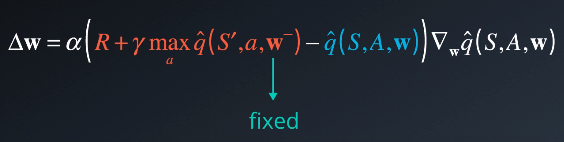

# Udacity Deep Reinforcement Learning Nano-degree

## Navigation Project Report

---

Ellen Zhang (yarong.zhang@gmail.com)

The goal of this project was to train an agent to navigate a simple world environment, collecting yellow bananas while avoiding blue bananas. 

The task is episodic, and in order to solve the environment, the agent must get `an average score of +13 over 100 consecutive episodes`.

### 1. Environment

``` from unityagents import UnityEnvironment ```


Unity Machine Learning Agents (ML-Agents) is an open-source Unity plugin that enables games and simulations to serve as environments for training intelligent agents.

For game developers, these trained agents can be used for multiple purposes, including controlling NPC behavior (in a variety of settings such as multi-agent and adversarial), automated testing of game builds and evaluating different game design decisions pre-release.

In this project, I use Unity's rich environments to design, train, and evaluate my deep reinforcement learning algorithms. Environments contain `brains` which are responsible for deciding the actions of their associated agents.

I did this project in my 64-bits Win10 and in Udacity workspace seperately. In win10, whatever it is 32-bit or 64-bit Unity enviroments, they all work well. 


```python
env = UnityEnvironment(file_name="Banana_Windows_x86_64/Banana.exe") #works in win10 64-bit
# env = UnityEnvironment(file_name="Banana_Windows_x86/Banana.exe")  #works in win10 64-bit

# env = UnityEnvironment(file_name="/data/Banana_Linux_NoVis/Banana.x86_64") #works in Udacity workspace
```

    INFO:unityagents:
    'Academy' started successfully!
    Unity Academy name: Academy
            Number of Brains: 1
            Number of External Brains : 1
            Lesson number : 0
            Reset Parameters :
    		
    Unity brain name: BananaBrain
            Number of Visual Observations (per agent): 0
            Vector Observation space type: continuous
            Vector Observation space size (per agent): 37
            Number of stacked Vector Observation: 1
            Vector Action space type: discrete
            Vector Action space size (per agent): 4
            Vector Action descriptions: , , , 
    

### 2.The State and Action Spaces

The simulation contains a single agent that navigates a large environment.  At each time step, it has four actions at its disposal:
- `0` - walk forward 
- `1` - walk backward
- `2` - turn left
- `3` - turn right

The state space has `37` dimensions and contains the agent's velocity, along with ray-based perception of objects around agent's forward direction.  A reward of `+1` is provided for collecting a yellow banana, and a reward of `-1` is provided for collecting a blue banana. 

### 3.Algorithm

The solution implemented is a simple Deep Q-Learning (DQN) algorithm based on [ research paper ](https://storage.googleapis.com/deepmind-media/dqn/DQNNaturePaper.pdf). It included experience replay and fixed Q targets, both of which are considered standard in a DQN.


To approximate the value function, a simple neural network with three fully connected layers with ReLU activation function is used. 

```
QNetwork(
  (fc1): Linear(in_features=37, out_features=64, bias=True)
  (fc2): Linear(in_features=64, out_features=64, bias=True)
  (fc3): Linear(in_features=64, out_features=4, bias=True)
)

```

- the input layer which size depends of the state_size, which is given 37 states
- 1 hidden fully connected layers of 64 cells each
- the output layer which size depends of the action_size, which is 4 actions


The naive Q-learning algorithm has found to be unstable when `neural networks` are used to represent the action values. So there are `two key features` introduced into it to prevent action values from oscillation.

- Experience replay

    When the agent interacts with the environment, the sequence of experience tuples can be highly correlated. The naive Q-learning algorithm that learns from each of these experience tuples in sequential order runs the risk of getting swayed by the effects of this correlation. By instead keeping track of a replay buffer and using experience replay to sample from the buffer at random, we can prevent action values from oscillating or diverging catastrophically.

    The replay buffer contains a collection of experience tuples (S, A, R, S'). The tuples are gradually added to the buffer as we are interacting with the environment.

    The act of sampling a small batch of tuples from the replay buffer in order to learn is known as experience replay. In addition to breaking harmful correlations, experience replay allows us to learn more from individual tuples multiple times, recall rare occurrences, and in general make better use of our experience.


    We store the last 100,000 experience tuples (S, A, R, S′) into a data container called replay buffer from which we sample a mini-batch of 64 experiences. This batch ensures that the experiences are not highly correlated/independet and stable enough to train the network.




- Fixed Q-targets

    In Q-Learning, we update a guess with a guess, and this can potentially lead to harmful correlations. To avoid this, we can use the above update rule to better approximate the action value corresponding to state S and action A.   


Algorithm screenshot comes from [Udacity video course](https://classroom.udacity.com/nanodegrees/nd893-ent/parts/b5175725-8f50-4cd9-8666-fd4c1375039c/modules/56dab924-27c9-43ab-b898-3bdab18f6fd2/lessons/4adf70aa-0c4c-4a48-8bbe-e3619874f234/concepts/637ff801-c1e1-4eb8-90cb-c9bcda92ca77) 


The DQN algorithm is implemented in dqn_agent.py file. It contains a DQN agent class and a Replay Buffer class.

Agent class provides 5 methods：

1. constructor:
    - Initialize the memory buffer (Replay Buffer)
    - Initialize 2 instance of the Neural Network : the target network and the local network
2. step
    - Allows to store a step taken by the agent in the Replay Buffer/Memory
    - Every 4 steps to update the target network weights with the current weight values from the local network (That's part of the Fixed Q Targets technique)
3. act
    - returns actions for the given state as per current policy
4. learn
    - update the Neural Network value parameters using given batch of experiences from the Replay Buffer
5. soft_update
    - softly updates the value from the target Neural Network from the local network weights 

ReplayBuffer class provide 2 methods:
1. add
    - add an experience step to the memory
2. sample
    - randomly sample a batch of experience steps for the learning

### 4. The result

The simple model used successfully solved the problem after around 180 to 220 episodes based on the fixed hyper parameters and slightly changed epsilon value.

- The hyper-parameters is fixed during the training and the testing.
```
BUFFER_SIZE = int(1e5)  # replay buffer size
BATCH_SIZE = 64         # minibatch size
GAMMA = 0.99            # discount factor
TAU = 1e-3              # for soft update of target parameters
LR = 5e-4               # learning rate 
UPDATE_EVERY = 4        # how often to update the network
```


- The training score dispicts as pic shows.


```scores, avgs_moving = dqn(n_episodes=1000, eps_start=1.0, eps_end=0.03, eps_decay=0.95)```
```
Episode 100	Average Score: 6.42
Episode 200	Average Score: 10.82
Episode 280	Average Score: 13.11
Environment solved in 180 episodes!	Average Score: 13.11

```

```scores, avgs_moving = dqn(n_episodes=1000, eps_start=1.0, eps_end=0.02, eps_decay=0.95)```

```
Episode 100	Average Score: 4.96
Episode 200	Average Score: 9.27
Episode 287	Average Score: 13.14
Environment solved in 187 episodes!	Average Score: 13.14
```
```
Episode 100	Average Score: 6.41
Episode 200	Average Score: 11.45
Episode 300	Average Score: 12.67
Episode 320	Average Score: 13.12
Environment solved in 220 episodes!	Average Score: 13.12

```

- The testing result(10 episodes):
All testing results are not over 13. May need more trainings.

 

After changing the training break condition, the test score shows as below:

 


### 5. DQN improvements and Future work

Against some shortage of Basic DQN algorithm, there are three different improvements. For example

- Double DQN

Deep Q-Learning tends to overestimate action values. Double Q-Learning has been shown to work well in practice to help with this.

- Prioritized Experience Replay

Deep Q-Learning samples experience transitions uniformly from a replay memory. Prioritized Experience Replay is based on the idea that the agent can learn more effectively from some transitions than from others, and the more important transitions should be sampled with higher probability.

- Duelling DQN

Currently, in order to determine which states are (or are not) valuable, we have to estimate the corresponding action values for each action. However, by replacing the traditional Deep Q-Network (DQN) architecture with a duelling architecture, we can assess the value of each state, without having to learn the effect of each action.

For future improvement, I believe Dueling DQN would be very efficient.


```python

```
