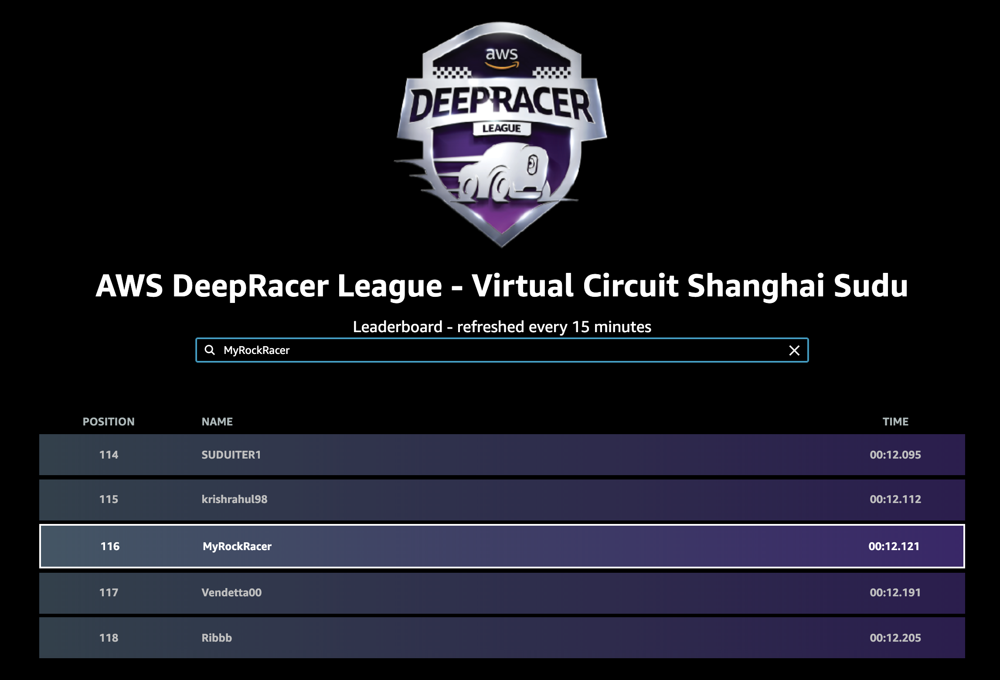
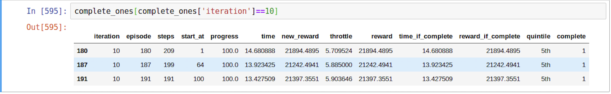

- DeepRacer League Final Result in August


- Udacity Final Result in August


- DeepRacer League Final Result in September


- Udacity Final Result in September


## Fight for MLND scholarship 

- 2019.9.12 Based on model 37. 3 completion lap, 4.8-8.5-12. Train best: 13.70
```
			"lr": 0.000000095,
            "e_greedy_value": 0.001,
            "beta_entropy": 0.001,
            "discount_factor": 0.999,
            "loss_type": "mean squared error",
            Speed: 5-8.5-12

```

	1. First Round:            
```
            reward = progress + speed

            Test: 12.694, model 7, complete 2 laps, Train best: 12.63
```
	2. Second Round
```
			reward = progress + 3*speed
			Test: model 25(Complete 2 laps, Train Best: 13.98)
```

	3. Third Round:
```			reward = progress
			Model 7 completes 3 laps, Train best: 13.202049
			Test: Unable to finish
```

	4. Fourth Round: 
```
			"e_greedy_value": 0.005,
            "beta_entropy": 0.005,
            reward = progress
            track: re-invent
```
	5. Fifth Round: Based on fourth round output

```			
			iteration
			1    1
			2    2
			3    3
			6    3
 		3 	54 	192 	13.436392
 		6 	111 193 	13.448521
 		3 	45 	197 	13.645805
 		1 	15 	197 	13.750239
 		6 	115 198 	13.774340
 		3 	52 	197 	13.775600
 		2 	32 	201 	14.072245
 		6 	102 203 	14.104736
 		2 	35 	210 	14.679358

 		Pick up: model 2 and 5 to test
 			M2: 12.674
 			M5: unable

 		model folder: 1209/BaseOnInvent
```

	6. Sixth Round: Based On Fifth output model 5
```
		track: Virtual_May19_Train_track 5 epochs
				China_track 5 epochs
				Mexico track

		Model 1, model 2 complete 2 laps, m2 train best: 13.299033
		Test: Model2 12.350
```


	7. Seventh Round: 
```
		Test: 12.567, 
		folder: 1309/12.567_m7
```
- 9.13 Training

	1. First Round: Failed, deleted


	2. Second Round:
	```
 			Based on 9.12 the sixth output model 2
 			"lr": 0.00000005,
			"e_greedy_value": 0.005,
			"beta_entropy": 0.005,
			reward = progress + speed,

			Model 9: 3 laps, best train: 13.427509

			Evaluate: 

			Test: 12.262(new record)
			
			folder: 1309/12.262_m9
	```

	

	3. Third Round:

			```Based on 9.13 second output model 9. ```


			


			

			


 		


