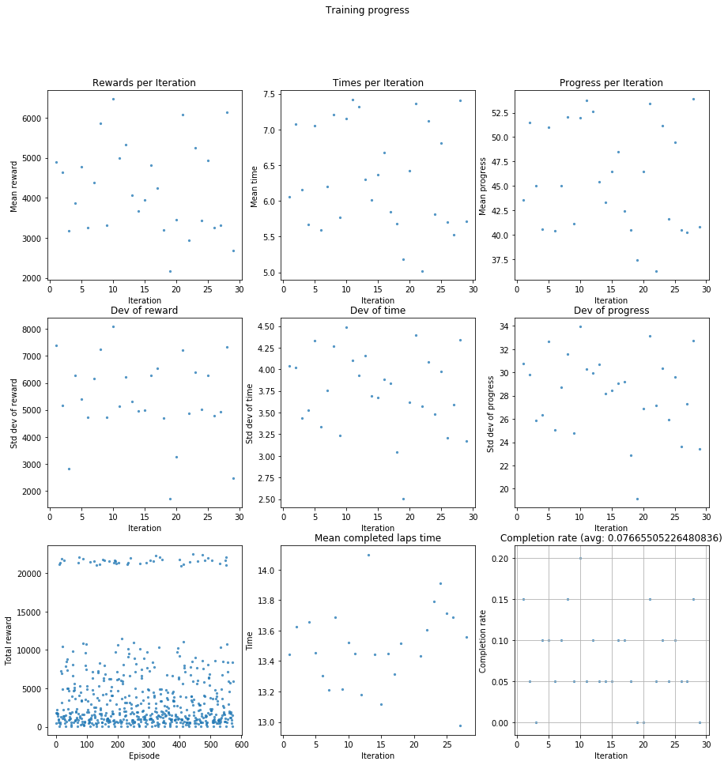
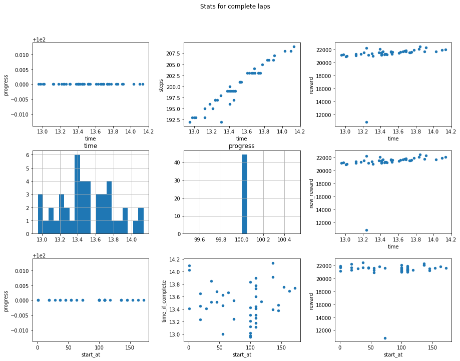
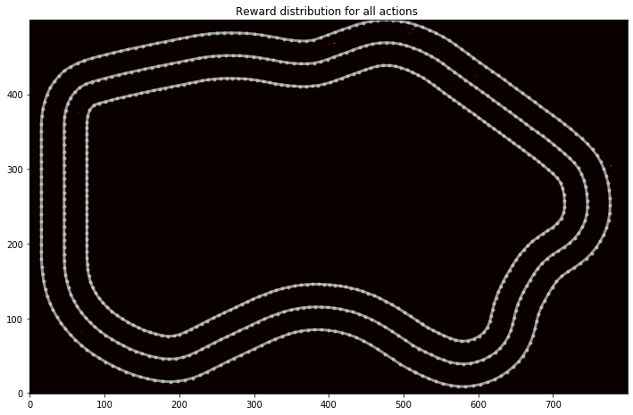
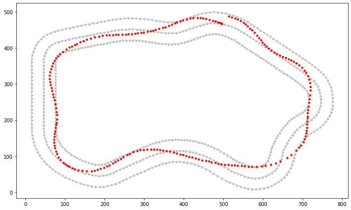

# Simulation Run Log Analysis and Visualization for AWS DeepRacer

This notebook walks through how you can analyze and debug using the AWS DeepRacer Simulation logs 

```
1. Tools to find best iteration of your model
2. Visualize reward distribution on the track
  2.1 Visualize reward heatmap per episode or iteration
3. Identify hotspots on the track for your model
4. Understand probability distributions on simulated images
5. Evaluation run analysis - plot lap speed heatmap
```

## Requirements

boto3 >= 1.9.133  ; configure your aws cli and/or boto credentials file

AWS CLI: https://docs.aws.amazon.com/cli/latest/userguide/cli-chap-configure.html

Boto Configuration: https://boto3.amazonaws.com/v1/documentation/api/latest/guide/configuration.html


```python
import numpy as np
import pandas as pd
import matplotlib.pyplot as plt
from datetime import datetime
%matplotlib inline

#Shapely Library
from shapely.geometry import Point, Polygon
from shapely.geometry.polygon import LinearRing, LineString

import track_utils as tu
import log_analysis as la
import cw_utils as cw

# Make sure your boto version is >= '1.9.133'
cw.boto3.__version__
```


    '1.9.213'


```python
# reload log_analysis and the rest of stuff here if needed
# (handy for code updates in utils, doesn't break anything if no changes)
import importlib
importlib.reload(la)
importlib.reload(cw)
importlib.reload(tu)
```


    <module 'track_utils' from '/home/ellen/Udacity/deepracer-for-dummies/aws-deepracer-workshops/log-analysis/track_utils.py'>


## Load waypoints for the track you want to run analysis on

Tracks Available:


```python
!ls tracks/
```

    AWS_track.npy	      London_Loop_Train.npy    reinvent_base.npy
    Bowtie_track.npy      Mexico_track.npy	       Straight_track.npy
    China_eval_track.npy  New_York_Eval_Track.npy  Tokyo_Training_track.npy
    China_track.npy       New_York_Track.npy       Virtual_May19_Train_track.npy
    H_track.npy	      Oval_track.npy


```python
l_center_line, l_inner_border, l_outer_border, road_poly = tu.load_track("China_track")

road_poly
```

    Loaded 172 waypoints


## Load all evaluation data

It's good to keep things organised: group your files into folders to not lose track where they came from.


```python
# stream_name = 'sim-sample' ## CHANGE This to your simulation application ID
# fname = 'logs/deepracer-%s.log' %stream_name

# If you are using local training with either Alex or Chris, uncomment
# and use the below to always load the latest log from the log folder
# (Currently set to Alex' analysis log folder). In this case you don't
# need the download_log below to work.
fname = !ls -t logs/*.log*
fname = fname[0]
```


```python
print(fname)
```

    logs/rl_coach_1366_1568338615198.log


### Download the desired log file given the simulation ID 


If you wish to bulk export the logs from Amazon Cloudwatch to Amazon S3 :: 
https://docs.aws.amazon.com/AmazonCloudWatch/latest/logs/S3ExportTasks.html

_Use `force=True` to download again_


```python
#add force=True if you downloaded the file once but want to repeat
# cw.download_log(fname, stream_prefix=stream_name)

# !tail -n 3 $fname
```

## Load the trace training log


```python
EPISODES_PER_ITERATION = 20 #  Set to value of your hyperparameter in training

data = la.load_data(fname)
df = la.convert_to_pandas(data, episodes_per_iteration=EPISODES_PER_ITERATION)

df = df.sort_values(['episode', 'steps'])
# personally I think normalizing can mask too high rewards so I am commenting it out,
# but you might want it.
# la.normalize_rewards(df)
```

Note the first line below: it takes a reward class from log-analysis/rewards, imports, instantiates and recalculates for the log. This lets you do some testing before you start training and rule out some obvious things.

Just remember: not all params are provided, you are free to implement them and raise a Pull Request for log_analysis.df_to_params method.

Wrap your reward function like in the sample one below.

Final warning: there is a loss of precision in the logs and also potentially potential bugs. If you find any, please fix, please report.


```python
#Uncomment the line of code below to evaluate a different reward function
# la.new_reward(df, l_center_line, 'reward.reward_sample') #, verbose=True)

simulation_agg = la.simulation_agg(df)

la.analyze_training_progress(simulation_agg, title='Training progress')

# This gives the warning about ptp method deprecation. The code looks as if np.ptp was used, I don't know how to fix it.
la.scatter_aggregates(simulation_agg, 'Stats for all laps')

complete_ones = simulation_agg[simulation_agg['progress']==100]

if complete_ones.shape[0] > 0:
    la.scatter_aggregates(complete_ones, 'Stats for complete laps')

la.analyze_categories(simulation_agg, title='Quintiles')
```

    new reward not found, using reward as its values
    Number of episodes =  573
    Number of iterations =  29





    <Figure size 432x288 with 0 Axes>


    <Figure size 432x288 with 0 Axes>





    <Figure size 432x288 with 0 Axes>


    <Figure size 432x288 with 0 Axes>


The calls below are useful when you want to look at some values largest or smallest. You can then take the episode number and scatter it below.


```python
# this is useful if you struggle to get a complete lap
simulation_agg.nlargest(10, 'new_reward')
```


<div>
<style scoped>
    .dataframe tbody tr th:only-of-type {
        vertical-align: middle;
    }

    .dataframe tbody tr th {
        vertical-align: top;
    }

    .dataframe thead th {
        text-align: right;
    }
</style>
<table border="1" class="dataframe">
  <thead>
    <tr style="text-align: right;">
      <th></th>
      <th>iteration</th>
      <th>episode</th>
      <th>steps</th>
      <th>start_at</th>
      <th>progress</th>
      <th>time</th>
      <th>new_reward</th>
      <th>throttle</th>
      <th>reward</th>
      <th>time_if_complete</th>
      <th>reward_if_complete</th>
      <th>quintile</th>
      <th>complete</th>
    </tr>
  </thead>
  <tbody>
    <tr>
      <th>444</th>
      <td>23</td>
      <td>444</td>
      <td>206</td>
      <td>37</td>
      <td>100.0</td>
      <td>13.848139</td>
      <td>22492.4663</td>
      <td>5.804348</td>
      <td>22492.4663</td>
      <td>13.848139</td>
      <td>22492.4663</td>
      <td>4th</td>
      <td>1</td>
    </tr>
    <tr>
      <th>475</th>
      <td>24</td>
      <td>475</td>
      <td>207</td>
      <td>136</td>
      <td>100.0</td>
      <td>13.913733</td>
      <td>22332.3845</td>
      <td>5.884615</td>
      <td>22332.3845</td>
      <td>13.913733</td>
      <td>22332.3845</td>
      <td>5th</td>
      <td>1</td>
    </tr>
    <tr>
      <th>322</th>
      <td>17</td>
      <td>322</td>
      <td>197</td>
      <td>19</td>
      <td>100.0</td>
      <td>13.237965</td>
      <td>22241.8234</td>
      <td>5.946970</td>
      <td>22241.8234</td>
      <td>13.237965</td>
      <td>22241.8234</td>
      <td>3rd</td>
      <td>1</td>
    </tr>
    <tr>
      <th>335</th>
      <td>17</td>
      <td>335</td>
      <td>199</td>
      <td>136</td>
      <td>100.0</td>
      <td>13.394605</td>
      <td>22096.0059</td>
      <td>5.902500</td>
      <td>22096.0059</td>
      <td>13.394605</td>
      <td>22096.0059</td>
      <td>3rd</td>
      <td>1</td>
    </tr>
    <tr>
      <th>551</th>
      <td>28</td>
      <td>551</td>
      <td>206</td>
      <td>100</td>
      <td>100.0</td>
      <td>13.834035</td>
      <td>22092.6950</td>
      <td>6.074879</td>
      <td>22092.6950</td>
      <td>13.834035</td>
      <td>22092.6950</td>
      <td>5th</td>
      <td>1</td>
    </tr>
    <tr>
      <th>75</th>
      <td>4</td>
      <td>75</td>
      <td>209</td>
      <td>136</td>
      <td>100.0</td>
      <td>14.135823</td>
      <td>22064.5788</td>
      <td>5.792857</td>
      <td>22064.5788</td>
      <td>14.135823</td>
      <td>22064.5788</td>
      <td>1st</td>
      <td>1</td>
    </tr>
    <tr>
      <th>240</th>
      <td>13</td>
      <td>240</td>
      <td>208</td>
      <td>1</td>
      <td>100.0</td>
      <td>14.099387</td>
      <td>21974.2507</td>
      <td>5.595694</td>
      <td>21974.2507</td>
      <td>14.099387</td>
      <td>21974.2507</td>
      <td>3rd</td>
      <td>1</td>
    </tr>
    <tr>
      <th>492</th>
      <td>25</td>
      <td>492</td>
      <td>205</td>
      <td>109</td>
      <td>100.0</td>
      <td>13.776648</td>
      <td>21941.7301</td>
      <td>5.825243</td>
      <td>21941.7301</td>
      <td>13.776648</td>
      <td>21941.7301</td>
      <td>5th</td>
      <td>1</td>
    </tr>
    <tr>
      <th>18</th>
      <td>1</td>
      <td>18</td>
      <td>203</td>
      <td>163</td>
      <td>100.0</td>
      <td>13.688711</td>
      <td>21877.4215</td>
      <td>5.781863</td>
      <td>21877.4215</td>
      <td>13.688711</td>
      <td>21877.4215</td>
      <td>1st</td>
      <td>1</td>
    </tr>
    <tr>
      <th>87</th>
      <td>5</td>
      <td>87</td>
      <td>203</td>
      <td>64</td>
      <td>100.0</td>
      <td>13.669618</td>
      <td>21826.6686</td>
      <td>6.004902</td>
      <td>21826.6686</td>
      <td>13.669618</td>
      <td>21826.6686</td>
      <td>1st</td>
      <td>1</td>
    </tr>
  </tbody>
</table>
</div>


```python
# fastest complete laps
complete_ones.nsmallest(20, 'time')
```


<div>
<style scoped>
    .dataframe tbody tr th:only-of-type {
        vertical-align: middle;
    }

    .dataframe tbody tr th {
        vertical-align: top;
    }

    .dataframe thead th {
        text-align: right;
    }
</style>
<table border="1" class="dataframe">
  <thead>
    <tr style="text-align: right;">
      <th></th>
      <th>iteration</th>
      <th>episode</th>
      <th>steps</th>
      <th>start_at</th>
      <th>progress</th>
      <th>time</th>
      <th>new_reward</th>
      <th>throttle</th>
      <th>reward</th>
      <th>time_if_complete</th>
      <th>reward_if_complete</th>
      <th>quintile</th>
      <th>complete</th>
    </tr>
  </thead>
  <tbody>
    <tr>
      <th>231</th>
      <td>12</td>
      <td>231</td>
      <td>192</td>
      <td>100</td>
      <td>100.0</td>
      <td>12.952709</td>
      <td>21172.4717</td>
      <td>6.225389</td>
      <td>21172.4717</td>
      <td>12.952709</td>
      <td>21172.4717</td>
      <td>3rd</td>
      <td>1</td>
    </tr>
    <tr>
      <th>531</th>
      <td>27</td>
      <td>531</td>
      <td>193</td>
      <td>100</td>
      <td>100.0</td>
      <td>12.976783</td>
      <td>21247.0111</td>
      <td>6.146907</td>
      <td>21247.0111</td>
      <td>12.976783</td>
      <td>21247.0111</td>
      <td>5th</td>
      <td>1</td>
    </tr>
    <tr>
      <th>406</th>
      <td>21</td>
      <td>406</td>
      <td>193</td>
      <td>55</td>
      <td>100.0</td>
      <td>13.003698</td>
      <td>20907.3869</td>
      <td>5.930412</td>
      <td>20907.3869</td>
      <td>13.003698</td>
      <td>20907.3869</td>
      <td>4th</td>
      <td>1</td>
    </tr>
    <tr>
      <th>131</th>
      <td>7</td>
      <td>131</td>
      <td>193</td>
      <td>100</td>
      <td>100.0</td>
      <td>13.016094</td>
      <td>21031.8410</td>
      <td>6.056701</td>
      <td>21031.8410</td>
      <td>13.016094</td>
      <td>21031.8410</td>
      <td>2nd</td>
      <td>1</td>
    </tr>
    <tr>
      <th>292</th>
      <td>15</td>
      <td>292</td>
      <td>195</td>
      <td>109</td>
      <td>100.0</td>
      <td>13.118822</td>
      <td>21366.3823</td>
      <td>5.920918</td>
      <td>21366.3823</td>
      <td>13.118822</td>
      <td>21366.3823</td>
      <td>3rd</td>
      <td>1</td>
    </tr>
    <tr>
      <th>11</th>
      <td>1</td>
      <td>11</td>
      <td>193</td>
      <td>100</td>
      <td>100.0</td>
      <td>13.120935</td>
      <td>21137.0534</td>
      <td>6.201031</td>
      <td>21137.0534</td>
      <td>13.120935</td>
      <td>21137.0534</td>
      <td>1st</td>
      <td>1</td>
    </tr>
    <tr>
      <th>72</th>
      <td>4</td>
      <td>72</td>
      <td>196</td>
      <td>109</td>
      <td>100.0</td>
      <td>13.177283</td>
      <td>21298.4938</td>
      <td>6.111675</td>
      <td>21298.4938</td>
      <td>13.177283</td>
      <td>21298.4938</td>
      <td>1st</td>
      <td>1</td>
    </tr>
    <tr>
      <th>171</th>
      <td>9</td>
      <td>171</td>
      <td>195</td>
      <td>100</td>
      <td>100.0</td>
      <td>13.213392</td>
      <td>21549.9515</td>
      <td>6.206633</td>
      <td>21549.9515</td>
      <td>13.213392</td>
      <td>21549.9515</td>
      <td>2nd</td>
      <td>1</td>
    </tr>
    <tr>
      <th>322</th>
      <td>17</td>
      <td>322</td>
      <td>197</td>
      <td>19</td>
      <td>100.0</td>
      <td>13.237965</td>
      <td>22241.8234</td>
      <td>5.946970</td>
      <td>22241.8234</td>
      <td>13.237965</td>
      <td>22241.8234</td>
      <td>3rd</td>
      <td>1</td>
    </tr>
    <tr>
      <th>88</th>
      <td>5</td>
      <td>88</td>
      <td>197</td>
      <td>73</td>
      <td>100.0</td>
      <td>13.241896</td>
      <td>10813.6999</td>
      <td>6.053030</td>
      <td>10813.6999</td>
      <td>13.241896</td>
      <td>10813.6999</td>
      <td>1st</td>
      <td>1</td>
    </tr>
    <tr>
      <th>412</th>
      <td>21</td>
      <td>412</td>
      <td>197</td>
      <td>109</td>
      <td>100.0</td>
      <td>13.262420</td>
      <td>21158.3406</td>
      <td>6.000000</td>
      <td>21158.3406</td>
      <td>13.262420</td>
      <td>21158.3406</td>
      <td>4th</td>
      <td>1</td>
    </tr>
    <tr>
      <th>111</th>
      <td>6</td>
      <td>111</td>
      <td>198</td>
      <td>100</td>
      <td>100.0</td>
      <td>13.304009</td>
      <td>21432.3180</td>
      <td>6.100503</td>
      <td>21432.3180</td>
      <td>13.304009</td>
      <td>21432.3180</td>
      <td>1st</td>
      <td>1</td>
    </tr>
    <tr>
      <th>552</th>
      <td>28</td>
      <td>552</td>
      <td>192</td>
      <td>109</td>
      <td>100.0</td>
      <td>13.310477</td>
      <td>21017.9761</td>
      <td>5.844560</td>
      <td>21017.9761</td>
      <td>13.310477</td>
      <td>21017.9761</td>
      <td>5th</td>
      <td>1</td>
    </tr>
    <tr>
      <th>316</th>
      <td>16</td>
      <td>316</td>
      <td>199</td>
      <td>145</td>
      <td>100.0</td>
      <td>13.379025</td>
      <td>21555.3943</td>
      <td>6.165000</td>
      <td>21555.3943</td>
      <td>13.379025</td>
      <td>21555.3943</td>
      <td>3rd</td>
      <td>1</td>
    </tr>
    <tr>
      <th>335</th>
      <td>17</td>
      <td>335</td>
      <td>199</td>
      <td>136</td>
      <td>100.0</td>
      <td>13.394605</td>
      <td>22096.0059</td>
      <td>5.902500</td>
      <td>22096.0059</td>
      <td>13.394605</td>
      <td>22096.0059</td>
      <td>3rd</td>
      <td>1</td>
    </tr>
    <tr>
      <th>123</th>
      <td>7</td>
      <td>123</td>
      <td>200</td>
      <td>29</td>
      <td>100.0</td>
      <td>13.407414</td>
      <td>21527.9719</td>
      <td>5.863184</td>
      <td>21527.9719</td>
      <td>13.407414</td>
      <td>21527.9719</td>
      <td>2nd</td>
      <td>1</td>
    </tr>
    <tr>
      <th>140</th>
      <td>8</td>
      <td>140</td>
      <td>196</td>
      <td>1</td>
      <td>100.0</td>
      <td>13.407604</td>
      <td>21155.1069</td>
      <td>5.809645</td>
      <td>21155.1069</td>
      <td>13.407604</td>
      <td>21155.1069</td>
      <td>2nd</td>
      <td>1</td>
    </tr>
    <tr>
      <th>232</th>
      <td>12</td>
      <td>232</td>
      <td>199</td>
      <td>109</td>
      <td>100.0</td>
      <td>13.409418</td>
      <td>21313.9945</td>
      <td>6.007500</td>
      <td>21313.9945</td>
      <td>13.409418</td>
      <td>21313.9945</td>
      <td>3rd</td>
      <td>1</td>
    </tr>
    <tr>
      <th>191</th>
      <td>10</td>
      <td>191</td>
      <td>199</td>
      <td>100</td>
      <td>100.0</td>
      <td>13.425515</td>
      <td>21695.9539</td>
      <td>6.165000</td>
      <td>21695.9539</td>
      <td>13.425515</td>
      <td>21695.9539</td>
      <td>2nd</td>
      <td>1</td>
    </tr>
    <tr>
      <th>272</th>
      <td>14</td>
      <td>272</td>
      <td>199</td>
      <td>109</td>
      <td>100.0</td>
      <td>13.443750</td>
      <td>21264.6538</td>
      <td>5.832500</td>
      <td>21264.6538</td>
      <td>13.443750</td>
      <td>21264.6538</td>
      <td>3rd</td>
      <td>1</td>
    </tr>
  </tbody>
</table>
</div>


```python
complete_ones.groupby(['iteration'])['iteration'].count()
```


    iteration
    1     3
    2     1
    4     2
    5     2
    6     1
    7     2
    8     3
    9     1
    10    4
    11    1
    12    2
    13    1
    14    1
    15    1
    16    2
    17    2
    18    1
    21    3
    22    1
    23    2
    24    1
    25    2
    26    1
    27    1
    28    3
    Name: iteration, dtype: int64


```python
complete_ones[complete_ones['iteration']==12]
```


<div>
<style scoped>
    .dataframe tbody tr th:only-of-type {
        vertical-align: middle;
    }

    .dataframe tbody tr th {
        vertical-align: top;
    }

    .dataframe thead th {
        text-align: right;
    }
</style>
<table border="1" class="dataframe">
  <thead>
    <tr style="text-align: right;">
      <th></th>
      <th>iteration</th>
      <th>episode</th>
      <th>steps</th>
      <th>start_at</th>
      <th>progress</th>
      <th>time</th>
      <th>new_reward</th>
      <th>throttle</th>
      <th>reward</th>
      <th>time_if_complete</th>
      <th>reward_if_complete</th>
      <th>quintile</th>
      <th>complete</th>
    </tr>
  </thead>
  <tbody>
    <tr>
      <th>231</th>
      <td>12</td>
      <td>231</td>
      <td>192</td>
      <td>100</td>
      <td>100.0</td>
      <td>12.952709</td>
      <td>21172.4717</td>
      <td>6.225389</td>
      <td>21172.4717</td>
      <td>12.952709</td>
      <td>21172.4717</td>
      <td>3rd</td>
      <td>1</td>
    </tr>
    <tr>
      <th>232</th>
      <td>12</td>
      <td>232</td>
      <td>199</td>
      <td>109</td>
      <td>100.0</td>
      <td>13.409418</td>
      <td>21313.9945</td>
      <td>6.007500</td>
      <td>21313.9945</td>
      <td>13.409418</td>
      <td>21313.9945</td>
      <td>3rd</td>
      <td>1</td>
    </tr>
  </tbody>
</table>
</div>


```python
complete_ones[complete_ones['iteration']==10]
```


<div>
<style scoped>
    .dataframe tbody tr th:only-of-type {
        vertical-align: middle;
    }

    .dataframe tbody tr th {
        vertical-align: top;
    }

    .dataframe thead th {
        text-align: right;
    }
</style>
<table border="1" class="dataframe">
  <thead>
    <tr style="text-align: right;">
      <th></th>
      <th>iteration</th>
      <th>episode</th>
      <th>steps</th>
      <th>start_at</th>
      <th>progress</th>
      <th>time</th>
      <th>new_reward</th>
      <th>throttle</th>
      <th>reward</th>
      <th>time_if_complete</th>
      <th>reward_if_complete</th>
      <th>quintile</th>
      <th>complete</th>
    </tr>
  </thead>
  <tbody>
    <tr>
      <th>186</th>
      <td>10</td>
      <td>186</td>
      <td>199</td>
      <td>55</td>
      <td>100.0</td>
      <td>13.459264</td>
      <td>21329.7761</td>
      <td>5.920000</td>
      <td>21329.7761</td>
      <td>13.459264</td>
      <td>21329.7761</td>
      <td>2nd</td>
      <td>1</td>
    </tr>
    <tr>
      <th>191</th>
      <td>10</td>
      <td>191</td>
      <td>199</td>
      <td>100</td>
      <td>100.0</td>
      <td>13.425515</td>
      <td>21695.9539</td>
      <td>6.165000</td>
      <td>21695.9539</td>
      <td>13.425515</td>
      <td>21695.9539</td>
      <td>2nd</td>
      <td>1</td>
    </tr>
    <tr>
      <th>192</th>
      <td>10</td>
      <td>192</td>
      <td>203</td>
      <td>109</td>
      <td>100.0</td>
      <td>13.728147</td>
      <td>21590.1245</td>
      <td>5.919118</td>
      <td>21590.1245</td>
      <td>13.728147</td>
      <td>21590.1245</td>
      <td>2nd</td>
      <td>1</td>
    </tr>
    <tr>
      <th>196</th>
      <td>10</td>
      <td>196</td>
      <td>199</td>
      <td>145</td>
      <td>100.0</td>
      <td>13.469270</td>
      <td>21273.5897</td>
      <td>5.657500</td>
      <td>21273.5897</td>
      <td>13.469270</td>
      <td>21273.5897</td>
      <td>2nd</td>
      <td>1</td>
    </tr>
  </tbody>
</table>
</div>


```python
complete_ones[complete_ones['iteration']==8]
```


<div>
<style scoped>
    .dataframe tbody tr th:only-of-type {
        vertical-align: middle;
    }

    .dataframe tbody tr th {
        vertical-align: top;
    }

    .dataframe thead th {
        text-align: right;
    }
</style>
<table border="1" class="dataframe">
  <thead>
    <tr style="text-align: right;">
      <th></th>
      <th>iteration</th>
      <th>episode</th>
      <th>steps</th>
      <th>start_at</th>
      <th>progress</th>
      <th>time</th>
      <th>new_reward</th>
      <th>throttle</th>
      <th>reward</th>
      <th>time_if_complete</th>
      <th>reward_if_complete</th>
      <th>quintile</th>
      <th>complete</th>
    </tr>
  </thead>
  <tbody>
    <tr>
      <th>140</th>
      <td>8</td>
      <td>140</td>
      <td>196</td>
      <td>1</td>
      <td>100.0</td>
      <td>13.407604</td>
      <td>21155.1069</td>
      <td>5.809645</td>
      <td>21155.1069</td>
      <td>13.407604</td>
      <td>21155.1069</td>
      <td>2nd</td>
      <td>1</td>
    </tr>
    <tr>
      <th>152</th>
      <td>8</td>
      <td>152</td>
      <td>206</td>
      <td>109</td>
      <td>100.0</td>
      <td>13.899792</td>
      <td>21752.1757</td>
      <td>5.533816</td>
      <td>21752.1757</td>
      <td>13.899792</td>
      <td>21752.1757</td>
      <td>2nd</td>
      <td>1</td>
    </tr>
    <tr>
      <th>157</th>
      <td>8</td>
      <td>157</td>
      <td>203</td>
      <td>154</td>
      <td>100.0</td>
      <td>13.753206</td>
      <td>21625.2951</td>
      <td>5.919118</td>
      <td>21625.2951</td>
      <td>13.753206</td>
      <td>21625.2951</td>
      <td>2nd</td>
      <td>1</td>
    </tr>
  </tbody>
</table>
</div>


```python
complete_ones[complete_ones['iteration']==21]
```


<div>
<style scoped>
    .dataframe tbody tr th:only-of-type {
        vertical-align: middle;
    }

    .dataframe tbody tr th {
        vertical-align: top;
    }

    .dataframe thead th {
        text-align: right;
    }
</style>
<table border="1" class="dataframe">
  <thead>
    <tr style="text-align: right;">
      <th></th>
      <th>iteration</th>
      <th>episode</th>
      <th>steps</th>
      <th>start_at</th>
      <th>progress</th>
      <th>time</th>
      <th>new_reward</th>
      <th>throttle</th>
      <th>reward</th>
      <th>time_if_complete</th>
      <th>reward_if_complete</th>
      <th>quintile</th>
      <th>complete</th>
    </tr>
  </thead>
  <tbody>
    <tr>
      <th>400</th>
      <td>21</td>
      <td>400</td>
      <td>208</td>
      <td>1</td>
      <td>100.0</td>
      <td>14.030123</td>
      <td>21735.4914</td>
      <td>5.729665</td>
      <td>21735.4914</td>
      <td>14.030123</td>
      <td>21735.4914</td>
      <td>4th</td>
      <td>1</td>
    </tr>
    <tr>
      <th>406</th>
      <td>21</td>
      <td>406</td>
      <td>193</td>
      <td>55</td>
      <td>100.0</td>
      <td>13.003698</td>
      <td>20907.3869</td>
      <td>5.930412</td>
      <td>20907.3869</td>
      <td>13.003698</td>
      <td>20907.3869</td>
      <td>4th</td>
      <td>1</td>
    </tr>
    <tr>
      <th>412</th>
      <td>21</td>
      <td>412</td>
      <td>197</td>
      <td>109</td>
      <td>100.0</td>
      <td>13.262420</td>
      <td>21158.3406</td>
      <td>6.000000</td>
      <td>21158.3406</td>
      <td>13.262420</td>
      <td>21158.3406</td>
      <td>4th</td>
      <td>1</td>
    </tr>
  </tbody>
</table>
</div>


```python
complete_ones[complete_ones['iteration']==28]
```


<div>
<style scoped>
    .dataframe tbody tr th:only-of-type {
        vertical-align: middle;
    }

    .dataframe tbody tr th {
        vertical-align: top;
    }

    .dataframe thead th {
        text-align: right;
    }
</style>
<table border="1" class="dataframe">
  <thead>
    <tr style="text-align: right;">
      <th></th>
      <th>iteration</th>
      <th>episode</th>
      <th>steps</th>
      <th>start_at</th>
      <th>progress</th>
      <th>time</th>
      <th>new_reward</th>
      <th>throttle</th>
      <th>reward</th>
      <th>time_if_complete</th>
      <th>reward_if_complete</th>
      <th>quintile</th>
      <th>complete</th>
    </tr>
  </thead>
  <tbody>
    <tr>
      <th>548</th>
      <td>28</td>
      <td>548</td>
      <td>201</td>
      <td>73</td>
      <td>100.0</td>
      <td>13.537408</td>
      <td>21611.6219</td>
      <td>5.945545</td>
      <td>21611.6219</td>
      <td>13.537408</td>
      <td>21611.6219</td>
      <td>5th</td>
      <td>1</td>
    </tr>
    <tr>
      <th>551</th>
      <td>28</td>
      <td>551</td>
      <td>206</td>
      <td>100</td>
      <td>100.0</td>
      <td>13.834035</td>
      <td>22092.6950</td>
      <td>6.074879</td>
      <td>22092.6950</td>
      <td>13.834035</td>
      <td>22092.6950</td>
      <td>5th</td>
      <td>1</td>
    </tr>
    <tr>
      <th>552</th>
      <td>28</td>
      <td>552</td>
      <td>192</td>
      <td>109</td>
      <td>100.0</td>
      <td>13.310477</td>
      <td>21017.9761</td>
      <td>5.844560</td>
      <td>21017.9761</td>
      <td>13.310477</td>
      <td>21017.9761</td>
      <td>5th</td>
      <td>1</td>
    </tr>
  </tbody>
</table>
</div>


```python
complete_ones[complete_ones['iteration']==4]
```


<div>
<style scoped>
    .dataframe tbody tr th:only-of-type {
        vertical-align: middle;
    }

    .dataframe tbody tr th {
        vertical-align: top;
    }

    .dataframe thead th {
        text-align: right;
    }
</style>
<table border="1" class="dataframe">
  <thead>
    <tr style="text-align: right;">
      <th></th>
      <th>iteration</th>
      <th>episode</th>
      <th>steps</th>
      <th>start_at</th>
      <th>progress</th>
      <th>time</th>
      <th>new_reward</th>
      <th>throttle</th>
      <th>reward</th>
      <th>time_if_complete</th>
      <th>reward_if_complete</th>
      <th>quintile</th>
      <th>complete</th>
    </tr>
  </thead>
  <tbody>
    <tr>
      <th>72</th>
      <td>4</td>
      <td>72</td>
      <td>196</td>
      <td>109</td>
      <td>100.0</td>
      <td>13.177283</td>
      <td>21298.4938</td>
      <td>6.111675</td>
      <td>21298.4938</td>
      <td>13.177283</td>
      <td>21298.4938</td>
      <td>3rd</td>
      <td>1</td>
    </tr>
    <tr>
      <th>75</th>
      <td>4</td>
      <td>75</td>
      <td>209</td>
      <td>136</td>
      <td>100.0</td>
      <td>14.135823</td>
      <td>22064.5788</td>
      <td>5.792857</td>
      <td>22064.5788</td>
      <td>14.135823</td>
      <td>22064.5788</td>
      <td>3rd</td>
      <td>1</td>
    </tr>
  </tbody>
</table>
</div>


```python
complete_ones[complete_ones['iteration']==5]
```


<div>
<style scoped>
    .dataframe tbody tr th:only-of-type {
        vertical-align: middle;
    }

    .dataframe tbody tr th {
        vertical-align: top;
    }

    .dataframe thead th {
        text-align: right;
    }
</style>
<table border="1" class="dataframe">
  <thead>
    <tr style="text-align: right;">
      <th></th>
      <th>iteration</th>
      <th>episode</th>
      <th>steps</th>
      <th>start_at</th>
      <th>progress</th>
      <th>time</th>
      <th>new_reward</th>
      <th>throttle</th>
      <th>reward</th>
      <th>time_if_complete</th>
      <th>reward_if_complete</th>
      <th>quintile</th>
      <th>complete</th>
    </tr>
  </thead>
  <tbody>
    <tr>
      <th>87</th>
      <td>5</td>
      <td>87</td>
      <td>203</td>
      <td>64</td>
      <td>100.0</td>
      <td>13.669618</td>
      <td>21826.6686</td>
      <td>6.004902</td>
      <td>21826.6686</td>
      <td>13.669618</td>
      <td>21826.6686</td>
      <td>4th</td>
      <td>1</td>
    </tr>
    <tr>
      <th>88</th>
      <td>5</td>
      <td>88</td>
      <td>197</td>
      <td>73</td>
      <td>100.0</td>
      <td>13.241896</td>
      <td>10813.6999</td>
      <td>6.053030</td>
      <td>10813.6999</td>
      <td>13.241896</td>
      <td>10813.6999</td>
      <td>4th</td>
      <td>1</td>
    </tr>
  </tbody>
</table>
</div>


```python

```


```python

```


```python
df[df['episode']==137].groupby(['action'])['action'].count()
```


    action
    0.0     10
    3.0     24
    5.0     11
    6.0     30
    7.0      4
    8.0      3
    9.0     22
    10.0     1
    11.0     1
    12.0    30
    13.0     8
    14.0     8
    Name: action, dtype: int64


```python
# best rewards in completed laps
complete_ones.nlargest(10, 'reward')
```


<div>
<style scoped>
    .dataframe tbody tr th:only-of-type {
        vertical-align: middle;
    }

    .dataframe tbody tr th {
        vertical-align: top;
    }

    .dataframe thead th {
        text-align: right;
    }
</style>
<table border="1" class="dataframe">
  <thead>
    <tr style="text-align: right;">
      <th></th>
      <th>iteration</th>
      <th>episode</th>
      <th>steps</th>
      <th>start_at</th>
      <th>progress</th>
      <th>time</th>
      <th>new_reward</th>
      <th>throttle</th>
      <th>reward</th>
      <th>time_if_complete</th>
      <th>reward_if_complete</th>
      <th>quintile</th>
      <th>complete</th>
    </tr>
  </thead>
  <tbody>
    <tr>
      <th>7</th>
      <td>1</td>
      <td>7</td>
      <td>210</td>
      <td>64</td>
      <td>100.0</td>
      <td>14.785688</td>
      <td>22340.5571</td>
      <td>5.838863</td>
      <td>22340.5571</td>
      <td>14.785688</td>
      <td>22340.5571</td>
      <td>1st</td>
      <td>1</td>
    </tr>
    <tr>
      <th>25</th>
      <td>2</td>
      <td>25</td>
      <td>203</td>
      <td>46</td>
      <td>100.0</td>
      <td>14.713204</td>
      <td>22103.4925</td>
      <td>5.867647</td>
      <td>22103.4925</td>
      <td>14.713204</td>
      <td>22103.4925</td>
      <td>4th</td>
      <td>1</td>
    </tr>
    <tr>
      <th>12</th>
      <td>1</td>
      <td>12</td>
      <td>203</td>
      <td>109</td>
      <td>100.0</td>
      <td>14.316510</td>
      <td>21811.9282</td>
      <td>5.936275</td>
      <td>21811.9282</td>
      <td>14.316510</td>
      <td>21811.9282</td>
      <td>2nd</td>
      <td>1</td>
    </tr>
    <tr>
      <th>6</th>
      <td>1</td>
      <td>6</td>
      <td>192</td>
      <td>55</td>
      <td>100.0</td>
      <td>13.353105</td>
      <td>21752.9018</td>
      <td>6.189119</td>
      <td>21752.9018</td>
      <td>13.353105</td>
      <td>21752.9018</td>
      <td>1st</td>
      <td>1</td>
    </tr>
  </tbody>
</table>
</div>


```python
# best rewards in completed laps
complete_ones.nlargest(10, 'new_reward')
```


<div>
<style scoped>
    .dataframe tbody tr th:only-of-type {
        vertical-align: middle;
    }

    .dataframe tbody tr th {
        vertical-align: top;
    }

    .dataframe thead th {
        text-align: right;
    }
</style>
<table border="1" class="dataframe">
  <thead>
    <tr style="text-align: right;">
      <th></th>
      <th>iteration</th>
      <th>episode</th>
      <th>steps</th>
      <th>start_at</th>
      <th>progress</th>
      <th>time</th>
      <th>new_reward</th>
      <th>throttle</th>
      <th>reward</th>
      <th>time_if_complete</th>
      <th>reward_if_complete</th>
      <th>quintile</th>
      <th>complete</th>
    </tr>
  </thead>
  <tbody>
    <tr>
      <th>7</th>
      <td>1</td>
      <td>7</td>
      <td>210</td>
      <td>64</td>
      <td>100.0</td>
      <td>14.785688</td>
      <td>22340.5571</td>
      <td>5.838863</td>
      <td>22340.5571</td>
      <td>14.785688</td>
      <td>22340.5571</td>
      <td>1st</td>
      <td>1</td>
    </tr>
    <tr>
      <th>25</th>
      <td>2</td>
      <td>25</td>
      <td>203</td>
      <td>46</td>
      <td>100.0</td>
      <td>14.713204</td>
      <td>22103.4925</td>
      <td>5.867647</td>
      <td>22103.4925</td>
      <td>14.713204</td>
      <td>22103.4925</td>
      <td>4th</td>
      <td>1</td>
    </tr>
    <tr>
      <th>12</th>
      <td>1</td>
      <td>12</td>
      <td>203</td>
      <td>109</td>
      <td>100.0</td>
      <td>14.316510</td>
      <td>21811.9282</td>
      <td>5.936275</td>
      <td>21811.9282</td>
      <td>14.316510</td>
      <td>21811.9282</td>
      <td>2nd</td>
      <td>1</td>
    </tr>
    <tr>
      <th>6</th>
      <td>1</td>
      <td>6</td>
      <td>192</td>
      <td>55</td>
      <td>100.0</td>
      <td>13.353105</td>
      <td>21752.9018</td>
      <td>6.189119</td>
      <td>21752.9018</td>
      <td>13.353105</td>
      <td>21752.9018</td>
      <td>1st</td>
      <td>1</td>
    </tr>
  </tbody>
</table>
</div>


```python
# this is useful if you struggle to get a complete lap
simulation_agg.nlargest(10, 'progress')
```


<div>
<style scoped>
    .dataframe tbody tr th:only-of-type {
        vertical-align: middle;
    }

    .dataframe tbody tr th {
        vertical-align: top;
    }

    .dataframe thead th {
        text-align: right;
    }
</style>
<table border="1" class="dataframe">
  <thead>
    <tr style="text-align: right;">
      <th></th>
      <th>iteration</th>
      <th>episode</th>
      <th>steps</th>
      <th>start_at</th>
      <th>progress</th>
      <th>time</th>
      <th>new_reward</th>
      <th>throttle</th>
      <th>reward</th>
      <th>time_if_complete</th>
      <th>reward_if_complete</th>
      <th>quintile</th>
      <th>complete</th>
    </tr>
  </thead>
  <tbody>
    <tr>
      <th>20</th>
      <td>2</td>
      <td>20</td>
      <td>212</td>
      <td>1</td>
      <td>100.0</td>
      <td>14.917929</td>
      <td>30918.3801</td>
      <td>5.783568</td>
      <td>30918.3801</td>
      <td>14.917929</td>
      <td>30918.3801</td>
      <td>1st</td>
      <td>1</td>
    </tr>
    <tr>
      <th>22</th>
      <td>2</td>
      <td>22</td>
      <td>209</td>
      <td>19</td>
      <td>100.0</td>
      <td>14.557784</td>
      <td>30556.3782</td>
      <td>5.764286</td>
      <td>30556.3782</td>
      <td>14.557784</td>
      <td>30556.3782</td>
      <td>1st</td>
      <td>1</td>
    </tr>
    <tr>
      <th>37</th>
      <td>2</td>
      <td>37</td>
      <td>204</td>
      <td>154</td>
      <td>100.0</td>
      <td>14.342367</td>
      <td>41866.2122</td>
      <td>5.717561</td>
      <td>41866.2122</td>
      <td>14.342367</td>
      <td>41866.2122</td>
      <td>1st</td>
      <td>1</td>
    </tr>
    <tr>
      <th>48</th>
      <td>3</td>
      <td>48</td>
      <td>206</td>
      <td>73</td>
      <td>100.0</td>
      <td>14.438105</td>
      <td>30814.5294</td>
      <td>5.850725</td>
      <td>30814.5294</td>
      <td>14.438105</td>
      <td>30814.5294</td>
      <td>1st</td>
      <td>1</td>
    </tr>
    <tr>
      <th>80</th>
      <td>5</td>
      <td>80</td>
      <td>197</td>
      <td>1</td>
      <td>100.0</td>
      <td>13.844656</td>
      <td>29635.5601</td>
      <td>5.838384</td>
      <td>29635.5601</td>
      <td>13.844656</td>
      <td>29635.5601</td>
      <td>1st</td>
      <td>1</td>
    </tr>
    <tr>
      <th>126</th>
      <td>7</td>
      <td>126</td>
      <td>204</td>
      <td>55</td>
      <td>100.0</td>
      <td>14.236992</td>
      <td>30826.3488</td>
      <td>5.946341</td>
      <td>30826.3488</td>
      <td>14.236992</td>
      <td>30826.3488</td>
      <td>1st</td>
      <td>1</td>
    </tr>
    <tr>
      <th>131</th>
      <td>7</td>
      <td>131</td>
      <td>197</td>
      <td>100</td>
      <td>100.0</td>
      <td>13.888008</td>
      <td>42955.6217</td>
      <td>6.108586</td>
      <td>42955.6217</td>
      <td>13.888008</td>
      <td>42955.6217</td>
      <td>1st</td>
      <td>1</td>
    </tr>
    <tr>
      <th>155</th>
      <td>8</td>
      <td>155</td>
      <td>206</td>
      <td>136</td>
      <td>100.0</td>
      <td>14.448214</td>
      <td>30865.0542</td>
      <td>5.898551</td>
      <td>30865.0542</td>
      <td>14.448214</td>
      <td>30865.0542</td>
      <td>1st</td>
      <td>1</td>
    </tr>
    <tr>
      <th>156</th>
      <td>8</td>
      <td>156</td>
      <td>207</td>
      <td>145</td>
      <td>100.0</td>
      <td>14.518091</td>
      <td>30993.6504</td>
      <td>5.945673</td>
      <td>30993.6504</td>
      <td>14.518091</td>
      <td>30993.6504</td>
      <td>2nd</td>
      <td>1</td>
    </tr>
    <tr>
      <th>192</th>
      <td>10</td>
      <td>192</td>
      <td>205</td>
      <td>109</td>
      <td>100.0</td>
      <td>14.632048</td>
      <td>30494.7848</td>
      <td>5.887864</td>
      <td>30494.7848</td>
      <td>14.632048</td>
      <td>30494.7848</td>
      <td>2nd</td>
      <td>1</td>
    </tr>
  </tbody>
</table>
</div>


```python
# list all entries aggregated per episode. Handy for comparing the outcomes for reward and new_reward,
# but for not much else.
simulation_agg.head()
```


<div>
<style scoped>
    .dataframe tbody tr th:only-of-type {
        vertical-align: middle;
    }

    .dataframe tbody tr th {
        vertical-align: top;
    }

    .dataframe thead th {
        text-align: right;
    }
</style>
<table border="1" class="dataframe">
  <thead>
    <tr style="text-align: right;">
      <th></th>
      <th>iteration</th>
      <th>episode</th>
      <th>steps</th>
      <th>start_at</th>
      <th>progress</th>
      <th>time</th>
      <th>new_reward</th>
      <th>throttle</th>
      <th>reward</th>
      <th>time_if_complete</th>
      <th>reward_if_complete</th>
      <th>quintile</th>
      <th>complete</th>
    </tr>
  </thead>
  <tbody>
    <tr>
      <th>0</th>
      <td>1</td>
      <td>0</td>
      <td>127</td>
      <td>1</td>
      <td>61.6933</td>
      <td>9.001299</td>
      <td>9064.3649</td>
      <td>5.921094</td>
      <td>9064.3649</td>
      <td>14.590399</td>
      <td>14692.624483</td>
      <td>1st</td>
      <td>0</td>
    </tr>
    <tr>
      <th>1</th>
      <td>1</td>
      <td>1</td>
      <td>83</td>
      <td>10</td>
      <td>39.4397</td>
      <td>5.914320</td>
      <td>5846.2194</td>
      <td>6.503571</td>
      <td>5846.2194</td>
      <td>14.995854</td>
      <td>14823.184253</td>
      <td>1st</td>
      <td>0</td>
    </tr>
    <tr>
      <th>2</th>
      <td>1</td>
      <td>2</td>
      <td>102</td>
      <td>19</td>
      <td>49.1341</td>
      <td>7.155650</td>
      <td>6620.7150</td>
      <td>5.953398</td>
      <td>6620.7150</td>
      <td>14.563510</td>
      <td>13474.786350</td>
      <td>1st</td>
      <td>0</td>
    </tr>
    <tr>
      <th>3</th>
      <td>1</td>
      <td>3</td>
      <td>62</td>
      <td>29</td>
      <td>29.7707</td>
      <td>4.290094</td>
      <td>3887.8749</td>
      <td>6.342857</td>
      <td>3887.8749</td>
      <td>14.410458</td>
      <td>13059.400350</td>
      <td>1st</td>
      <td>0</td>
    </tr>
    <tr>
      <th>4</th>
      <td>1</td>
      <td>4</td>
      <td>91</td>
      <td>37</td>
      <td>42.7934</td>
      <td>6.401909</td>
      <td>6194.4616</td>
      <td>6.285870</td>
      <td>6194.4616</td>
      <td>14.960037</td>
      <td>14475.273290</td>
      <td>1st</td>
      <td>0</td>
    </tr>
  </tbody>
</table>
</div>


```python
pd.set_option('display.max_rows', 500)

# list all parsed log lines. Handy for comparing the outcomes for reward and new_reward,
# but for not much else.
df[df['episode']==82]
```


<div>
<style scoped>
    .dataframe tbody tr th:only-of-type {
        vertical-align: middle;
    }

    .dataframe tbody tr th {
        vertical-align: top;
    }

    .dataframe thead th {
        text-align: right;
    }
</style>
<table border="1" class="dataframe">
  <thead>
    <tr style="text-align: right;">
      <th></th>
      <th>iteration</th>
      <th>episode</th>
      <th>steps</th>
      <th>x</th>
      <th>y</th>
      <th>yaw</th>
      <th>steer</th>
      <th>throttle</th>
      <th>action</th>
      <th>reward</th>
      <th>done</th>
      <th>on_track</th>
      <th>progress</th>
      <th>closest_waypoint</th>
      <th>track_len</th>
      <th>timestamp</th>
      <th>new_reward</th>
    </tr>
  </thead>
  <tbody>
    <tr>
      <th>9765</th>
      <td>5</td>
      <td>82</td>
      <td>0</td>
      <td>416.48</td>
      <td>260.19</td>
      <td>2.8361</td>
      <td>0.00</td>
      <td>0.0</td>
      <td>0.0</td>
      <td>0.6900</td>
      <td>0</td>
      <td>True</td>
      <td>0.6900</td>
      <td>19</td>
      <td>20.51</td>
      <td>1568181243.3632002</td>
      <td>0.6900</td>
    </tr>
    <tr>
      <th>9766</th>
      <td>5</td>
      <td>82</td>
      <td>1</td>
      <td>416.26</td>
      <td>260.25</td>
      <td>2.8370</td>
      <td>-0.26</td>
      <td>4.5</td>
      <td>3.0</td>
      <td>20.9512</td>
      <td>0</td>
      <td>True</td>
      <td>0.7012</td>
      <td>19</td>
      <td>20.51</td>
      <td>1568181243.428211</td>
      <td>20.9512</td>
    </tr>
    <tr>
      <th>9767</th>
      <td>5</td>
      <td>82</td>
      <td>2</td>
      <td>415.26</td>
      <td>260.60</td>
      <td>2.8347</td>
      <td>-0.26</td>
      <td>8.5</td>
      <td>4.0</td>
      <td>73.0023</td>
      <td>0</td>
      <td>True</td>
      <td>0.7523</td>
      <td>19</td>
      <td>20.51</td>
      <td>1568181243.5060692</td>
      <td>73.0023</td>
    </tr>
    <tr>
      <th>9768</th>
      <td>5</td>
      <td>82</td>
      <td>3</td>
      <td>412.44</td>
      <td>261.65</td>
      <td>2.8243</td>
      <td>0.26</td>
      <td>12.0</td>
      <td>11.0</td>
      <td>144.8989</td>
      <td>0</td>
      <td>True</td>
      <td>0.8989</td>
      <td>20</td>
      <td>20.51</td>
      <td>1568181243.5647137</td>
      <td>144.8989</td>
    </tr>
    <tr>
      <th>9769</th>
      <td>5</td>
      <td>82</td>
      <td>4</td>
      <td>408.96</td>
      <td>262.93</td>
      <td>2.8177</td>
      <td>-0.26</td>
      <td>8.5</td>
      <td>4.0</td>
      <td>73.3295</td>
      <td>0</td>
      <td>True</td>
      <td>1.0795</td>
      <td>20</td>
      <td>20.51</td>
      <td>1568181243.6428757</td>
      <td>73.3295</td>
    </tr>
    <tr>
      <th>9770</th>
      <td>5</td>
      <td>82</td>
      <td>5</td>
      <td>403.08</td>
      <td>265.31</td>
      <td>2.7936</td>
      <td>0.00</td>
      <td>4.5</td>
      <td>6.0</td>
      <td>21.6363</td>
      <td>0</td>
      <td>True</td>
      <td>1.3863</td>
      <td>20</td>
      <td>20.51</td>
      <td>1568181243.7275999</td>
      <td>21.6363</td>
    </tr>
    <tr>
      <th>9771</th>
      <td>5</td>
      <td>82</td>
      <td>6</td>
      <td>396.22</td>
      <td>268.09</td>
      <td>2.7768</td>
      <td>0.52</td>
      <td>4.5</td>
      <td>12.0</td>
      <td>21.9925</td>
      <td>0</td>
      <td>True</td>
      <td>1.7425</td>
      <td>21</td>
      <td>20.51</td>
      <td>1568181243.8067079</td>
      <td>21.9925</td>
    </tr>
    <tr>
      <th>9772</th>
      <td>5</td>
      <td>82</td>
      <td>7</td>
      <td>387.63</td>
      <td>271.10</td>
      <td>2.7906</td>
      <td>0.52</td>
      <td>4.5</td>
      <td>12.0</td>
      <td>22.4341</td>
      <td>0</td>
      <td>True</td>
      <td>2.1841</td>
      <td>22</td>
      <td>20.51</td>
      <td>1568181243.8692017</td>
      <td>22.4341</td>
    </tr>
    <tr>
      <th>9773</th>
      <td>5</td>
      <td>82</td>
      <td>8</td>
      <td>379.61</td>
      <td>273.36</td>
      <td>2.8246</td>
      <td>0.52</td>
      <td>4.5</td>
      <td>12.0</td>
      <td>22.8273</td>
      <td>0</td>
      <td>True</td>
      <td>2.5773</td>
      <td>23</td>
      <td>20.51</td>
      <td>1568181243.9279766</td>
      <td>22.8273</td>
    </tr>
    <tr>
      <th>9774</th>
      <td>5</td>
      <td>82</td>
      <td>9</td>
      <td>370.65</td>
      <td>275.20</td>
      <td>2.8800</td>
      <td>0.00</td>
      <td>4.5</td>
      <td>6.0</td>
      <td>23.2524</td>
      <td>0</td>
      <td>True</td>
      <td>3.0024</td>
      <td>23</td>
      <td>20.51</td>
      <td>1568181243.9885554</td>
      <td>23.2524</td>
    </tr>
    <tr>
      <th>9775</th>
      <td>5</td>
      <td>82</td>
      <td>10</td>
      <td>362.97</td>
      <td>276.48</td>
      <td>2.9212</td>
      <td>0.26</td>
      <td>4.5</td>
      <td>9.0</td>
      <td>23.6172</td>
      <td>0</td>
      <td>True</td>
      <td>3.3672</td>
      <td>24</td>
      <td>20.51</td>
      <td>1568181244.0650568</td>
      <td>23.6172</td>
    </tr>
    <tr>
      <th>9776</th>
      <td>5</td>
      <td>82</td>
      <td>11</td>
      <td>352.10</td>
      <td>277.56</td>
      <td>2.9892</td>
      <td>0.00</td>
      <td>4.5</td>
      <td>6.0</td>
      <td>24.1483</td>
      <td>0</td>
      <td>True</td>
      <td>3.8983</td>
      <td>25</td>
      <td>20.51</td>
      <td>1568181244.138529</td>
      <td>24.1483</td>
    </tr>
    <tr>
      <th>9777</th>
      <td>5</td>
      <td>82</td>
      <td>12</td>
      <td>342.84</td>
      <td>278.18</td>
      <td>3.0309</td>
      <td>-0.26</td>
      <td>4.5</td>
      <td>3.0</td>
      <td>24.5950</td>
      <td>0</td>
      <td>True</td>
      <td>4.3450</td>
      <td>26</td>
      <td>20.51</td>
      <td>1568181244.2063317</td>
      <td>24.5950</td>
    </tr>
    <tr>
      <th>9778</th>
      <td>5</td>
      <td>82</td>
      <td>13</td>
      <td>334.82</td>
      <td>278.78</td>
      <td>3.0460</td>
      <td>-0.26</td>
      <td>4.5</td>
      <td>3.0</td>
      <td>24.9886</td>
      <td>0</td>
      <td>True</td>
      <td>4.7386</td>
      <td>28</td>
      <td>20.51</td>
      <td>1568181244.2749023</td>
      <td>24.9886</td>
    </tr>
    <tr>
      <th>9779</th>
      <td>5</td>
      <td>82</td>
      <td>14</td>
      <td>325.34</td>
      <td>279.63</td>
      <td>3.0485</td>
      <td>-0.26</td>
      <td>4.5</td>
      <td>3.0</td>
      <td>25.4515</td>
      <td>0</td>
      <td>True</td>
      <td>5.2015</td>
      <td>28</td>
      <td>20.51</td>
      <td>1568181244.3555636</td>
      <td>25.4515</td>
    </tr>
    <tr>
      <th>9780</th>
      <td>5</td>
      <td>82</td>
      <td>15</td>
      <td>315.34</td>
      <td>280.74</td>
      <td>3.0393</td>
      <td>0.00</td>
      <td>4.5</td>
      <td>6.0</td>
      <td>25.9394</td>
      <td>0</td>
      <td>True</td>
      <td>5.6894</td>
      <td>29</td>
      <td>20.51</td>
      <td>1568181244.4146845</td>
      <td>25.9394</td>
    </tr>
    <tr>
      <th>9781</th>
      <td>5</td>
      <td>82</td>
      <td>16</td>
      <td>306.71</td>
      <td>281.68</td>
      <td>3.0366</td>
      <td>0.00</td>
      <td>4.5</td>
      <td>6.0</td>
      <td>26.3609</td>
      <td>0</td>
      <td>True</td>
      <td>6.1109</td>
      <td>30</td>
      <td>20.51</td>
      <td>1568181244.4749444</td>
      <td>26.3609</td>
    </tr>
    <tr>
      <th>9782</th>
      <td>5</td>
      <td>82</td>
      <td>17</td>
      <td>296.45</td>
      <td>282.88</td>
      <td>3.0303</td>
      <td>-0.26</td>
      <td>4.5</td>
      <td>3.0</td>
      <td>26.8613</td>
      <td>0</td>
      <td>True</td>
      <td>6.6113</td>
      <td>30</td>
      <td>20.51</td>
      <td>1568181244.5549898</td>
      <td>26.8613</td>
    </tr>
    <tr>
      <th>9783</th>
      <td>5</td>
      <td>82</td>
      <td>18</td>
      <td>289.62</td>
      <td>283.91</td>
      <td>3.0156</td>
      <td>0.00</td>
      <td>4.5</td>
      <td>6.0</td>
      <td>27.1948</td>
      <td>0</td>
      <td>True</td>
      <td>6.9448</td>
      <td>31</td>
      <td>20.51</td>
      <td>1568181244.6038551</td>
      <td>27.1948</td>
    </tr>
    <tr>
      <th>9784</th>
      <td>5</td>
      <td>82</td>
      <td>19</td>
      <td>280.75</td>
      <td>285.21</td>
      <td>3.0070</td>
      <td>0.26</td>
      <td>4.5</td>
      <td>9.0</td>
      <td>27.6279</td>
      <td>0</td>
      <td>True</td>
      <td>7.3779</td>
      <td>31</td>
      <td>20.51</td>
      <td>1568181244.6904047</td>
      <td>27.6279</td>
    </tr>
    <tr>
      <th>9785</th>
      <td>5</td>
      <td>82</td>
      <td>20</td>
      <td>271.55</td>
      <td>286.29</td>
      <td>3.0161</td>
      <td>0.26</td>
      <td>8.5</td>
      <td>10.0</td>
      <td>80.0581</td>
      <td>0</td>
      <td>True</td>
      <td>7.8081</td>
      <td>32</td>
      <td>20.51</td>
      <td>1568181244.7478893</td>
      <td>80.0581</td>
    </tr>
    <tr>
      <th>9786</th>
      <td>5</td>
      <td>82</td>
      <td>21</td>
      <td>263.09</td>
      <td>286.94</td>
      <td>3.0394</td>
      <td>0.52</td>
      <td>4.5</td>
      <td>12.0</td>
      <td>28.4698</td>
      <td>0</td>
      <td>True</td>
      <td>8.2198</td>
      <td>33</td>
      <td>20.51</td>
      <td>1568181244.812507</td>
      <td>28.4698</td>
    </tr>
    <tr>
      <th>9787</th>
      <td>5</td>
      <td>82</td>
      <td>22</td>
      <td>253.81</td>
      <td>286.86</td>
      <td>3.0923</td>
      <td>0.52</td>
      <td>4.5</td>
      <td>12.0</td>
      <td>28.9016</td>
      <td>0</td>
      <td>True</td>
      <td>8.6516</td>
      <td>34</td>
      <td>20.51</td>
      <td>1568181244.8956785</td>
      <td>28.9016</td>
    </tr>
    <tr>
      <th>9788</th>
      <td>5</td>
      <td>82</td>
      <td>23</td>
      <td>243.04</td>
      <td>285.88</td>
      <td>-3.1159</td>
      <td>0.52</td>
      <td>12.0</td>
      <td>14.0</td>
      <td>153.1218</td>
      <td>0</td>
      <td>True</td>
      <td>9.1218</td>
      <td>34</td>
      <td>20.51</td>
      <td>1568181244.9659493</td>
      <td>153.1218</td>
    </tr>
    <tr>
      <th>9789</th>
      <td>5</td>
      <td>82</td>
      <td>24</td>
      <td>233.74</td>
      <td>283.99</td>
      <td>-3.0198</td>
      <td>0.00</td>
      <td>4.5</td>
      <td>6.0</td>
      <td>29.7333</td>
      <td>0</td>
      <td>True</td>
      <td>9.4833</td>
      <td>35</td>
      <td>20.51</td>
      <td>1568181245.0395436</td>
      <td>29.7333</td>
    </tr>
    <tr>
      <th>9790</th>
      <td>5</td>
      <td>82</td>
      <td>25</td>
      <td>222.94</td>
      <td>280.81</td>
      <td>-2.9117</td>
      <td>0.52</td>
      <td>8.5</td>
      <td>13.0</td>
      <td>82.2784</td>
      <td>0</td>
      <td>True</td>
      <td>10.0284</td>
      <td>36</td>
      <td>20.51</td>
      <td>1568181245.1110022</td>
      <td>82.2784</td>
    </tr>
    <tr>
      <th>9791</th>
      <td>5</td>
      <td>82</td>
      <td>26</td>
      <td>214.76</td>
      <td>277.30</td>
      <td>-2.8229</td>
      <td>0.00</td>
      <td>4.5</td>
      <td>6.0</td>
      <td>30.6067</td>
      <td>0</td>
      <td>True</td>
      <td>10.3567</td>
      <td>37</td>
      <td>20.51</td>
      <td>1568181245.1688879</td>
      <td>30.6067</td>
    </tr>
    <tr>
      <th>9792</th>
      <td>5</td>
      <td>82</td>
      <td>27</td>
      <td>206.53</td>
      <td>272.81</td>
      <td>-2.7198</td>
      <td>0.52</td>
      <td>12.0</td>
      <td>14.0</td>
      <td>154.7234</td>
      <td>0</td>
      <td>True</td>
      <td>10.7234</td>
      <td>37</td>
      <td>20.51</td>
      <td>1568181245.2306035</td>
      <td>154.7234</td>
    </tr>
    <tr>
      <th>9793</th>
      <td>5</td>
      <td>82</td>
      <td>28</td>
      <td>196.00</td>
      <td>265.32</td>
      <td>-2.5713</td>
      <td>0.00</td>
      <td>4.5</td>
      <td>6.0</td>
      <td>31.5359</td>
      <td>0</td>
      <td>True</td>
      <td>11.2859</td>
      <td>38</td>
      <td>20.51</td>
      <td>1568181245.3038852</td>
      <td>31.5359</td>
    </tr>
    <tr>
      <th>9794</th>
      <td>5</td>
      <td>82</td>
      <td>29</td>
      <td>189.63</td>
      <td>259.58</td>
      <td>-2.4517</td>
      <td>0.52</td>
      <td>4.5</td>
      <td>12.0</td>
      <td>31.9331</td>
      <td>0</td>
      <td>True</td>
      <td>11.6831</td>
      <td>39</td>
      <td>20.51</td>
      <td>1568181245.3576925</td>
      <td>31.9331</td>
    </tr>
    <tr>
      <th>9795</th>
      <td>5</td>
      <td>82</td>
      <td>30</td>
      <td>183.18</td>
      <td>251.92</td>
      <td>-2.3424</td>
      <td>0.52</td>
      <td>12.0</td>
      <td>14.0</td>
      <td>156.1400</td>
      <td>0</td>
      <td>True</td>
      <td>12.1400</td>
      <td>40</td>
      <td>20.51</td>
      <td>1568181245.4495573</td>
      <td>156.1400</td>
    </tr>
    <tr>
      <th>9796</th>
      <td>5</td>
      <td>82</td>
      <td>31</td>
      <td>177.81</td>
      <td>243.60</td>
      <td>-2.2353</td>
      <td>0.26</td>
      <td>4.5</td>
      <td>9.0</td>
      <td>32.8196</td>
      <td>0</td>
      <td>True</td>
      <td>12.5696</td>
      <td>41</td>
      <td>20.51</td>
      <td>1568181245.5056174</td>
      <td>32.8196</td>
    </tr>
    <tr>
      <th>9797</th>
      <td>5</td>
      <td>82</td>
      <td>32</td>
      <td>173.06</td>
      <td>234.01</td>
      <td>-2.0806</td>
      <td>0.00</td>
      <td>4.5</td>
      <td>6.0</td>
      <td>33.2884</td>
      <td>0</td>
      <td>True</td>
      <td>13.0384</td>
      <td>41</td>
      <td>20.51</td>
      <td>1568181245.5810082</td>
      <td>33.2884</td>
    </tr>
    <tr>
      <th>9798</th>
      <td>5</td>
      <td>82</td>
      <td>33</td>
      <td>169.98</td>
      <td>225.34</td>
      <td>-1.9706</td>
      <td>0.52</td>
      <td>4.5</td>
      <td>12.0</td>
      <td>33.6942</td>
      <td>0</td>
      <td>True</td>
      <td>13.4442</td>
      <td>42</td>
      <td>20.51</td>
      <td>1568181245.644016</td>
      <td>33.6942</td>
    </tr>
    <tr>
      <th>9799</th>
      <td>5</td>
      <td>82</td>
      <td>34</td>
      <td>167.64</td>
      <td>215.40</td>
      <td>-1.8807</td>
      <td>0.26</td>
      <td>4.5</td>
      <td>9.0</td>
      <td>34.1617</td>
      <td>0</td>
      <td>True</td>
      <td>13.9117</td>
      <td>43</td>
      <td>20.51</td>
      <td>1568181245.725432</td>
      <td>34.1617</td>
    </tr>
    <tr>
      <th>9800</th>
      <td>5</td>
      <td>82</td>
      <td>35</td>
      <td>166.34</td>
      <td>206.37</td>
      <td>-1.7992</td>
      <td>0.26</td>
      <td>4.5</td>
      <td>9.0</td>
      <td>34.5823</td>
      <td>0</td>
      <td>True</td>
      <td>14.3323</td>
      <td>44</td>
      <td>20.51</td>
      <td>1568181245.7818422</td>
      <td>34.5823</td>
    </tr>
    <tr>
      <th>9801</th>
      <td>5</td>
      <td>82</td>
      <td>36</td>
      <td>165.74</td>
      <td>196.88</td>
      <td>-1.7159</td>
      <td>0.26</td>
      <td>4.5</td>
      <td>9.0</td>
      <td>35.0364</td>
      <td>0</td>
      <td>True</td>
      <td>14.7864</td>
      <td>45</td>
      <td>20.51</td>
      <td>1568181245.867548</td>
      <td>35.0364</td>
    </tr>
    <tr>
      <th>9802</th>
      <td>5</td>
      <td>82</td>
      <td>37</td>
      <td>165.80</td>
      <td>189.73</td>
      <td>-1.6555</td>
      <td>0.52</td>
      <td>4.5</td>
      <td>12.0</td>
      <td>35.4012</td>
      <td>0</td>
      <td>True</td>
      <td>15.1512</td>
      <td>45</td>
      <td>20.51</td>
      <td>1568181245.9228795</td>
      <td>35.4012</td>
    </tr>
    <tr>
      <th>9803</th>
      <td>5</td>
      <td>82</td>
      <td>38</td>
      <td>166.64</td>
      <td>180.05</td>
      <td>-1.5688</td>
      <td>0.00</td>
      <td>4.5</td>
      <td>6.0</td>
      <td>35.9097</td>
      <td>0</td>
      <td>True</td>
      <td>15.6597</td>
      <td>46</td>
      <td>20.51</td>
      <td>1568181245.9937146</td>
      <td>35.9097</td>
    </tr>
    <tr>
      <th>9804</th>
      <td>5</td>
      <td>82</td>
      <td>39</td>
      <td>168.55</td>
      <td>169.54</td>
      <td>-1.4737</td>
      <td>0.52</td>
      <td>4.5</td>
      <td>12.0</td>
      <td>36.5019</td>
      <td>0</td>
      <td>True</td>
      <td>16.2519</td>
      <td>47</td>
      <td>20.51</td>
      <td>1568181246.0643282</td>
      <td>36.5019</td>
    </tr>
    <tr>
      <th>9805</th>
      <td>5</td>
      <td>82</td>
      <td>40</td>
      <td>170.55</td>
      <td>162.14</td>
      <td>-1.4047</td>
      <td>0.00</td>
      <td>4.5</td>
      <td>6.0</td>
      <td>36.8594</td>
      <td>0</td>
      <td>True</td>
      <td>16.6094</td>
      <td>48</td>
      <td>20.51</td>
      <td>1568181246.1363761</td>
      <td>36.8594</td>
    </tr>
    <tr>
      <th>9806</th>
      <td>5</td>
      <td>82</td>
      <td>41</td>
      <td>173.64</td>
      <td>153.01</td>
      <td>-1.3241</td>
      <td>-0.26</td>
      <td>4.5</td>
      <td>3.0</td>
      <td>37.5515</td>
      <td>0</td>
      <td>True</td>
      <td>17.3015</td>
      <td>49</td>
      <td>20.51</td>
      <td>1568181246.2007346</td>
      <td>37.5515</td>
    </tr>
    <tr>
      <th>9807</th>
      <td>5</td>
      <td>82</td>
      <td>42</td>
      <td>176.76</td>
      <td>144.47</td>
      <td>-1.2771</td>
      <td>0.52</td>
      <td>4.5</td>
      <td>12.0</td>
      <td>37.9910</td>
      <td>0</td>
      <td>True</td>
      <td>17.7410</td>
      <td>50</td>
      <td>20.51</td>
      <td>1568181246.2738266</td>
      <td>37.9910</td>
    </tr>
    <tr>
      <th>9808</th>
      <td>5</td>
      <td>82</td>
      <td>43</td>
      <td>181.70</td>
      <td>133.25</td>
      <td>-1.2088</td>
      <td>0.00</td>
      <td>4.5</td>
      <td>6.0</td>
      <td>38.7716</td>
      <td>0</td>
      <td>True</td>
      <td>18.5216</td>
      <td>51</td>
      <td>20.51</td>
      <td>1568181246.355818</td>
      <td>38.7716</td>
    </tr>
    <tr>
      <th>9809</th>
      <td>5</td>
      <td>82</td>
      <td>44</td>
      <td>184.84</td>
      <td>126.83</td>
      <td>-1.1727</td>
      <td>0.26</td>
      <td>4.5</td>
      <td>9.0</td>
      <td>39.2222</td>
      <td>0</td>
      <td>True</td>
      <td>18.9722</td>
      <td>52</td>
      <td>20.51</td>
      <td>1568181246.4112754</td>
      <td>39.2222</td>
    </tr>
    <tr>
      <th>9810</th>
      <td>5</td>
      <td>82</td>
      <td>45</td>
      <td>189.18</td>
      <td>119.01</td>
      <td>-1.1216</td>
      <td>0.26</td>
      <td>8.5</td>
      <td>10.0</td>
      <td>91.7772</td>
      <td>0</td>
      <td>True</td>
      <td>19.5272</td>
      <td>53</td>
      <td>20.51</td>
      <td>1568181246.4639723</td>
      <td>91.7772</td>
    </tr>
    <tr>
      <th>9811</th>
      <td>5</td>
      <td>82</td>
      <td>46</td>
      <td>194.34</td>
      <td>111.33</td>
      <td>-1.0465</td>
      <td>0.26</td>
      <td>4.5</td>
      <td>9.0</td>
      <td>40.3669</td>
      <td>0</td>
      <td>True</td>
      <td>20.1169</td>
      <td>54</td>
      <td>20.51</td>
      <td>1568181246.544013</td>
      <td>40.3669</td>
    </tr>
    <tr>
      <th>9812</th>
      <td>5</td>
      <td>82</td>
      <td>47</td>
      <td>199.81</td>
      <td>104.52</td>
      <td>-0.9673</td>
      <td>0.26</td>
      <td>12.0</td>
      <td>11.0</td>
      <td>164.6939</td>
      <td>0</td>
      <td>True</td>
      <td>20.6939</td>
      <td>55</td>
      <td>20.51</td>
      <td>1568181246.6027982</td>
      <td>164.6939</td>
    </tr>
    <tr>
      <th>9813</th>
      <td>5</td>
      <td>82</td>
      <td>48</td>
      <td>208.19</td>
      <td>95.88</td>
      <td>-0.8644</td>
      <td>0.26</td>
      <td>8.5</td>
      <td>10.0</td>
      <td>93.6587</td>
      <td>0</td>
      <td>True</td>
      <td>21.4087</td>
      <td>56</td>
      <td>20.51</td>
      <td>1568181246.6873481</td>
      <td>93.6587</td>
    </tr>
    <tr>
      <th>9814</th>
      <td>5</td>
      <td>82</td>
      <td>49</td>
      <td>217.22</td>
      <td>88.72</td>
      <td>-0.7454</td>
      <td>0.52</td>
      <td>4.5</td>
      <td>12.0</td>
      <td>42.3241</td>
      <td>0</td>
      <td>True</td>
      <td>22.0741</td>
      <td>58</td>
      <td>20.51</td>
      <td>1568181246.7538297</td>
      <td>42.3241</td>
    </tr>
    <tr>
      <th>9815</th>
      <td>5</td>
      <td>82</td>
      <td>50</td>
      <td>225.93</td>
      <td>83.34</td>
      <td>-0.6257</td>
      <td>0.52</td>
      <td>4.5</td>
      <td>12.0</td>
      <td>42.9088</td>
      <td>0</td>
      <td>True</td>
      <td>22.6588</td>
      <td>59</td>
      <td>20.51</td>
      <td>1568181246.839754</td>
      <td>42.9088</td>
    </tr>
    <tr>
      <th>9816</th>
      <td>5</td>
      <td>82</td>
      <td>51</td>
      <td>237.03</td>
      <td>78.43</td>
      <td>-0.4991</td>
      <td>0.52</td>
      <td>4.5</td>
      <td>12.0</td>
      <td>43.6725</td>
      <td>0</td>
      <td>True</td>
      <td>23.4225</td>
      <td>60</td>
      <td>20.51</td>
      <td>1568181246.915167</td>
      <td>43.6725</td>
    </tr>
    <tr>
      <th>9817</th>
      <td>5</td>
      <td>82</td>
      <td>52</td>
      <td>246.14</td>
      <td>75.57</td>
      <td>-0.3997</td>
      <td>0.52</td>
      <td>12.0</td>
      <td>14.0</td>
      <td>167.9448</td>
      <td>0</td>
      <td>True</td>
      <td>23.9448</td>
      <td>61</td>
      <td>20.51</td>
      <td>1568181246.9750228</td>
      <td>167.9448</td>
    </tr>
    <tr>
      <th>9818</th>
      <td>5</td>
      <td>82</td>
      <td>53</td>
      <td>256.11</td>
      <td>73.66</td>
      <td>-0.2867</td>
      <td>0.26</td>
      <td>4.5</td>
      <td>9.0</td>
      <td>44.6844</td>
      <td>0</td>
      <td>True</td>
      <td>24.4344</td>
      <td>62</td>
      <td>20.51</td>
      <td>1568181247.0515106</td>
      <td>44.6844</td>
    </tr>
    <tr>
      <th>9819</th>
      <td>5</td>
      <td>82</td>
      <td>54</td>
      <td>264.06</td>
      <td>73.12</td>
      <td>-0.1910</td>
      <td>0.26</td>
      <td>4.5</td>
      <td>9.0</td>
      <td>45.0949</td>
      <td>0</td>
      <td>True</td>
      <td>24.8449</td>
      <td>63</td>
      <td>20.51</td>
      <td>1568181247.1165528</td>
      <td>45.0949</td>
    </tr>
    <tr>
      <th>9820</th>
      <td>5</td>
      <td>82</td>
      <td>55</td>
      <td>274.14</td>
      <td>73.37</td>
      <td>-0.0772</td>
      <td>-0.26</td>
      <td>4.5</td>
      <td>3.0</td>
      <td>45.5923</td>
      <td>0</td>
      <td>True</td>
      <td>25.3423</td>
      <td>64</td>
      <td>20.51</td>
      <td>1568181247.1737242</td>
      <td>45.5923</td>
    </tr>
    <tr>
      <th>9821</th>
      <td>5</td>
      <td>82</td>
      <td>56</td>
      <td>281.66</td>
      <td>74.12</td>
      <td>-0.0025</td>
      <td>-0.52</td>
      <td>4.5</td>
      <td>0.0</td>
      <td>45.9573</td>
      <td>0</td>
      <td>True</td>
      <td>25.7073</td>
      <td>64</td>
      <td>20.51</td>
      <td>1568181247.2289562</td>
      <td>45.9573</td>
    </tr>
    <tr>
      <th>9822</th>
      <td>5</td>
      <td>82</td>
      <td>57</td>
      <td>288.72</td>
      <td>74.89</td>
      <td>0.0422</td>
      <td>-0.52</td>
      <td>4.5</td>
      <td>0.0</td>
      <td>46.3016</td>
      <td>0</td>
      <td>True</td>
      <td>26.0516</td>
      <td>65</td>
      <td>20.51</td>
      <td>1568181247.3007383</td>
      <td>46.3016</td>
    </tr>
    <tr>
      <th>9823</th>
      <td>5</td>
      <td>82</td>
      <td>58</td>
      <td>299.79</td>
      <td>76.10</td>
      <td>0.0787</td>
      <td>0.00</td>
      <td>4.5</td>
      <td>6.0</td>
      <td>46.8416</td>
      <td>0</td>
      <td>True</td>
      <td>26.5916</td>
      <td>66</td>
      <td>20.51</td>
      <td>1568181247.3857107</td>
      <td>46.8416</td>
    </tr>
    <tr>
      <th>9824</th>
      <td>5</td>
      <td>82</td>
      <td>59</td>
      <td>307.94</td>
      <td>76.97</td>
      <td>0.0913</td>
      <td>-0.26</td>
      <td>4.5</td>
      <td>3.0</td>
      <td>47.2408</td>
      <td>0</td>
      <td>True</td>
      <td>26.9908</td>
      <td>67</td>
      <td>20.51</td>
      <td>1568181247.4546962</td>
      <td>47.2408</td>
    </tr>
    <tr>
      <th>9825</th>
      <td>5</td>
      <td>82</td>
      <td>60</td>
      <td>319.17</td>
      <td>78.13</td>
      <td>0.0969</td>
      <td>0.26</td>
      <td>4.5</td>
      <td>9.0</td>
      <td>47.7882</td>
      <td>0</td>
      <td>True</td>
      <td>27.5382</td>
      <td>68</td>
      <td>20.51</td>
      <td>1568181247.5443008</td>
      <td>47.7882</td>
    </tr>
    <tr>
      <th>9826</th>
      <td>5</td>
      <td>82</td>
      <td>61</td>
      <td>327.82</td>
      <td>79.11</td>
      <td>0.1054</td>
      <td>0.00</td>
      <td>4.5</td>
      <td>6.0</td>
      <td>48.2088</td>
      <td>0</td>
      <td>True</td>
      <td>27.9588</td>
      <td>68</td>
      <td>20.51</td>
      <td>1568181247.5877671</td>
      <td>48.2088</td>
    </tr>
    <tr>
      <th>9827</th>
      <td>5</td>
      <td>82</td>
      <td>62</td>
      <td>336.31</td>
      <td>80.10</td>
      <td>0.1103</td>
      <td>0.00</td>
      <td>4.5</td>
      <td>6.0</td>
      <td>48.6247</td>
      <td>0</td>
      <td>True</td>
      <td>28.3747</td>
      <td>69</td>
      <td>20.51</td>
      <td>1568181247.651584</td>
      <td>48.6247</td>
    </tr>
    <tr>
      <th>9828</th>
      <td>5</td>
      <td>82</td>
      <td>63</td>
      <td>344.31</td>
      <td>80.99</td>
      <td>0.1104</td>
      <td>-0.26</td>
      <td>12.0</td>
      <td>5.0</td>
      <td>172.7647</td>
      <td>0</td>
      <td>True</td>
      <td>28.7647</td>
      <td>70</td>
      <td>20.51</td>
      <td>1568181247.726234</td>
      <td>172.7647</td>
    </tr>
    <tr>
      <th>9829</th>
      <td>5</td>
      <td>82</td>
      <td>64</td>
      <td>354.99</td>
      <td>81.80</td>
      <td>0.0918</td>
      <td>-0.26</td>
      <td>4.5</td>
      <td>3.0</td>
      <td>49.5355</td>
      <td>0</td>
      <td>True</td>
      <td>29.2855</td>
      <td>71</td>
      <td>20.51</td>
      <td>1568181247.7835827</td>
      <td>49.5355</td>
    </tr>
    <tr>
      <th>9830</th>
      <td>5</td>
      <td>82</td>
      <td>65</td>
      <td>365.19</td>
      <td>82.11</td>
      <td>0.0614</td>
      <td>-0.52</td>
      <td>4.5</td>
      <td>0.0</td>
      <td>50.0286</td>
      <td>0</td>
      <td>True</td>
      <td>29.7786</td>
      <td>72</td>
      <td>20.51</td>
      <td>1568181247.8506188</td>
      <td>50.0286</td>
    </tr>
    <tr>
      <th>9831</th>
      <td>5</td>
      <td>82</td>
      <td>66</td>
      <td>374.55</td>
      <td>81.70</td>
      <td>0.0084</td>
      <td>0.26</td>
      <td>4.5</td>
      <td>9.0</td>
      <td>50.4864</td>
      <td>0</td>
      <td>True</td>
      <td>30.2364</td>
      <td>72</td>
      <td>20.51</td>
      <td>1568181247.9134138</td>
      <td>50.4864</td>
    </tr>
    <tr>
      <th>9832</th>
      <td>5</td>
      <td>82</td>
      <td>67</td>
      <td>384.43</td>
      <td>80.98</td>
      <td>-0.0318</td>
      <td>-0.26</td>
      <td>4.5</td>
      <td>3.0</td>
      <td>50.9733</td>
      <td>0</td>
      <td>True</td>
      <td>30.7233</td>
      <td>73</td>
      <td>20.51</td>
      <td>1568181247.986433</td>
      <td>50.9733</td>
    </tr>
    <tr>
      <th>9833</th>
      <td>5</td>
      <td>82</td>
      <td>68</td>
      <td>392.59</td>
      <td>80.04</td>
      <td>-0.0691</td>
      <td>0.00</td>
      <td>4.5</td>
      <td>6.0</td>
      <td>51.3706</td>
      <td>0</td>
      <td>True</td>
      <td>31.1206</td>
      <td>74</td>
      <td>20.51</td>
      <td>1568181248.0647264</td>
      <td>51.3706</td>
    </tr>
    <tr>
      <th>9834</th>
      <td>5</td>
      <td>82</td>
      <td>69</td>
      <td>402.09</td>
      <td>78.85</td>
      <td>-0.0971</td>
      <td>0.00</td>
      <td>4.5</td>
      <td>6.0</td>
      <td>51.8221</td>
      <td>0</td>
      <td>True</td>
      <td>31.5721</td>
      <td>75</td>
      <td>20.51</td>
      <td>1568181248.129775</td>
      <td>51.8221</td>
    </tr>
    <tr>
      <th>9835</th>
      <td>5</td>
      <td>82</td>
      <td>70</td>
      <td>410.32</td>
      <td>77.67</td>
      <td>-0.1166</td>
      <td>-0.52</td>
      <td>4.5</td>
      <td>0.0</td>
      <td>52.1746</td>
      <td>0</td>
      <td>True</td>
      <td>31.9246</td>
      <td>75</td>
      <td>20.51</td>
      <td>1568181248.1940763</td>
      <td>52.1746</td>
    </tr>
    <tr>
      <th>9836</th>
      <td>5</td>
      <td>82</td>
      <td>71</td>
      <td>419.13</td>
      <td>75.87</td>
      <td>-0.1524</td>
      <td>-0.26</td>
      <td>4.5</td>
      <td>3.0</td>
      <td>52.5134</td>
      <td>0</td>
      <td>True</td>
      <td>32.2634</td>
      <td>76</td>
      <td>20.51</td>
      <td>1568181248.2749386</td>
      <td>52.5134</td>
    </tr>
    <tr>
      <th>9837</th>
      <td>5</td>
      <td>82</td>
      <td>72</td>
      <td>429.41</td>
      <td>73.38</td>
      <td>-0.1984</td>
      <td>-0.52</td>
      <td>4.5</td>
      <td>0.0</td>
      <td>53.0286</td>
      <td>0</td>
      <td>True</td>
      <td>32.7786</td>
      <td>77</td>
      <td>20.51</td>
      <td>1568181248.3622124</td>
      <td>53.0286</td>
    </tr>
    <tr>
      <th>9838</th>
      <td>5</td>
      <td>82</td>
      <td>73</td>
      <td>438.33</td>
      <td>70.38</td>
      <td>-0.2551</td>
      <td>-0.26</td>
      <td>4.5</td>
      <td>3.0</td>
      <td>53.3611</td>
      <td>0</td>
      <td>True</td>
      <td>33.1111</td>
      <td>78</td>
      <td>20.51</td>
      <td>1568181248.4404674</td>
      <td>53.3611</td>
    </tr>
    <tr>
      <th>9839</th>
      <td>5</td>
      <td>82</td>
      <td>74</td>
      <td>448.02</td>
      <td>66.46</td>
      <td>-0.3240</td>
      <td>-0.52</td>
      <td>4.5</td>
      <td>0.0</td>
      <td>53.7237</td>
      <td>0</td>
      <td>True</td>
      <td>33.4737</td>
      <td>78</td>
      <td>20.51</td>
      <td>1568181248.5330217</td>
      <td>53.7237</td>
    </tr>
    <tr>
      <th>9840</th>
      <td>5</td>
      <td>82</td>
      <td>75</td>
      <td>457.40</td>
      <td>61.57</td>
      <td>-0.4065</td>
      <td>-0.52</td>
      <td>4.5</td>
      <td>0.0</td>
      <td>54.1331</td>
      <td>0</td>
      <td>True</td>
      <td>33.8831</td>
      <td>79</td>
      <td>20.51</td>
      <td>1568181248.5865378</td>
      <td>54.1331</td>
    </tr>
    <tr>
      <th>9841</th>
      <td>5</td>
      <td>82</td>
      <td>76</td>
      <td>462.89</td>
      <td>58.15</td>
      <td>-0.4616</td>
      <td>-0.52</td>
      <td>4.5</td>
      <td>0.0</td>
      <td>54.3923</td>
      <td>0</td>
      <td>True</td>
      <td>34.1423</td>
      <td>79</td>
      <td>20.51</td>
      <td>1568181248.6676755</td>
      <td>54.3923</td>
    </tr>
    <tr>
      <th>9842</th>
      <td>5</td>
      <td>82</td>
      <td>77</td>
      <td>472.88</td>
      <td>50.68</td>
      <td>-0.5716</td>
      <td>-0.26</td>
      <td>8.5</td>
      <td>4.0</td>
      <td>106.8769</td>
      <td>0</td>
      <td>True</td>
      <td>34.6269</td>
      <td>80</td>
      <td>20.51</td>
      <td>1568181248.7286603</td>
      <td>106.8769</td>
    </tr>
    <tr>
      <th>9843</th>
      <td>5</td>
      <td>82</td>
      <td>78</td>
      <td>477.94</td>
      <td>46.03</td>
      <td>-0.6398</td>
      <td>-0.52</td>
      <td>8.5</td>
      <td>1.0</td>
      <td>107.2084</td>
      <td>0</td>
      <td>True</td>
      <td>34.9584</td>
      <td>81</td>
      <td>20.51</td>
      <td>1568181248.779335</td>
      <td>107.2084</td>
    </tr>
    <tr>
      <th>9844</th>
      <td>5</td>
      <td>82</td>
      <td>79</td>
      <td>485.09</td>
      <td>37.90</td>
      <td>-0.7631</td>
      <td>0.26</td>
      <td>4.5</td>
      <td>9.0</td>
      <td>55.7190</td>
      <td>0</td>
      <td>True</td>
      <td>35.4690</td>
      <td>82</td>
      <td>20.51</td>
      <td>1568181248.8478332</td>
      <td>55.7190</td>
    </tr>
    <tr>
      <th>9845</th>
      <td>5</td>
      <td>82</td>
      <td>80</td>
      <td>490.22</td>
      <td>30.52</td>
      <td>-0.8839</td>
      <td>-0.26</td>
      <td>4.5</td>
      <td>3.0</td>
      <td>56.2566</td>
      <td>0</td>
      <td>True</td>
      <td>36.0066</td>
      <td>83</td>
      <td>20.51</td>
      <td>1568181248.9009156</td>
      <td>56.2566</td>
    </tr>
    <tr>
      <th>9846</th>
      <td>5</td>
      <td>82</td>
      <td>81</td>
      <td>494.77</td>
      <td>21.74</td>
      <td>-0.9967</td>
      <td>0.00</td>
      <td>4.5</td>
      <td>6.0</td>
      <td>56.8378</td>
      <td>0</td>
      <td>True</td>
      <td>36.5878</td>
      <td>84</td>
      <td>20.51</td>
      <td>1568181248.976465</td>
      <td>56.8378</td>
    </tr>
    <tr>
      <th>9847</th>
      <td>5</td>
      <td>82</td>
      <td>82</td>
      <td>498.30</td>
      <td>13.90</td>
      <td>-1.0669</td>
      <td>0.52</td>
      <td>12.0</td>
      <td>14.0</td>
      <td>181.0575</td>
      <td>0</td>
      <td>True</td>
      <td>37.0575</td>
      <td>85</td>
      <td>20.51</td>
      <td>1568181249.0343714</td>
      <td>181.0575</td>
    </tr>
    <tr>
      <th>9848</th>
      <td>5</td>
      <td>82</td>
      <td>83</td>
      <td>501.59</td>
      <td>6.25</td>
      <td>-1.1116</td>
      <td>0.26</td>
      <td>4.5</td>
      <td>9.0</td>
      <td>57.6578</td>
      <td>0</td>
      <td>True</td>
      <td>37.4078</td>
      <td>85</td>
      <td>20.51</td>
      <td>1568181249.1105776</td>
      <td>57.6578</td>
    </tr>
    <tr>
      <th>9849</th>
      <td>5</td>
      <td>82</td>
      <td>84</td>
      <td>505.40</td>
      <td>-3.04</td>
      <td>-1.1595</td>
      <td>-0.52</td>
      <td>12.0</td>
      <td>2.0</td>
      <td>181.7440</td>
      <td>0</td>
      <td>True</td>
      <td>37.7440</td>
      <td>86</td>
      <td>20.51</td>
      <td>1568181249.1881316</td>
      <td>181.7440</td>
    </tr>
    <tr>
      <th>9850</th>
      <td>5</td>
      <td>82</td>
      <td>85</td>
      <td>509.19</td>
      <td>-14.45</td>
      <td>-1.2146</td>
      <td>0.52</td>
      <td>12.0</td>
      <td>14.0</td>
      <td>182.0985</td>
      <td>0</td>
      <td>True</td>
      <td>38.0985</td>
      <td>87</td>
      <td>20.51</td>
      <td>1568181249.2757478</td>
      <td>182.0985</td>
    </tr>
    <tr>
      <th>9851</th>
      <td>5</td>
      <td>82</td>
      <td>86</td>
      <td>512.78</td>
      <td>-25.93</td>
      <td>-1.2440</td>
      <td>-0.52</td>
      <td>4.5</td>
      <td>0.0</td>
      <td>58.7579</td>
      <td>0</td>
      <td>True</td>
      <td>38.5079</td>
      <td>87</td>
      <td>20.51</td>
      <td>1568181249.3341746</td>
      <td>58.7579</td>
    </tr>
    <tr>
      <th>9852</th>
      <td>5</td>
      <td>82</td>
      <td>87</td>
      <td>516.17</td>
      <td>-37.62</td>
      <td>-1.2719</td>
      <td>0.26</td>
      <td>8.5</td>
      <td>10.0</td>
      <td>111.3095</td>
      <td>0</td>
      <td>False</td>
      <td>39.0595</td>
      <td>88</td>
      <td>20.51</td>
      <td>1568181249.41867</td>
      <td>111.3095</td>
    </tr>
    <tr>
      <th>9853</th>
      <td>5</td>
      <td>82</td>
      <td>88</td>
      <td>519.74</td>
      <td>-50.39</td>
      <td>-1.2882</td>
      <td>0.00</td>
      <td>12.0</td>
      <td>8.0</td>
      <td>183.8125</td>
      <td>0</td>
      <td>False</td>
      <td>39.8125</td>
      <td>90</td>
      <td>20.51</td>
      <td>1568181249.4801893</td>
      <td>183.8125</td>
    </tr>
    <tr>
      <th>9854</th>
      <td>5</td>
      <td>82</td>
      <td>89</td>
      <td>523.53</td>
      <td>-66.35</td>
      <td>-1.3273</td>
      <td>0.00</td>
      <td>8.5</td>
      <td>7.0</td>
      <td>114.7880</td>
      <td>0</td>
      <td>False</td>
      <td>42.5380</td>
      <td>95</td>
      <td>20.51</td>
      <td>1568181249.567559</td>
      <td>114.7880</td>
    </tr>
    <tr>
      <th>9855</th>
      <td>5</td>
      <td>82</td>
      <td>90</td>
      <td>526.46</td>
      <td>-81.95</td>
      <td>-1.3617</td>
      <td>0.00</td>
      <td>4.5</td>
      <td>6.0</td>
      <td>63.8702</td>
      <td>0</td>
      <td>False</td>
      <td>43.6202</td>
      <td>97</td>
      <td>20.51</td>
      <td>1568181249.6286535</td>
      <td>63.8702</td>
    </tr>
    <tr>
      <th>9856</th>
      <td>5</td>
      <td>82</td>
      <td>91</td>
      <td>528.52</td>
      <td>-94.47</td>
      <td>-1.3952</td>
      <td>0.26</td>
      <td>4.5</td>
      <td>9.0</td>
      <td>64.4696</td>
      <td>0</td>
      <td>False</td>
      <td>44.2196</td>
      <td>98</td>
      <td>20.51</td>
      <td>1568181249.6997254</td>
      <td>64.4696</td>
    </tr>
    <tr>
      <th>9857</th>
      <td>5</td>
      <td>82</td>
      <td>92</td>
      <td>530.40</td>
      <td>-106.78</td>
      <td>-1.4519</td>
      <td>-0.26</td>
      <td>4.5</td>
      <td>3.0</td>
      <td>65.0093</td>
      <td>0</td>
      <td>False</td>
      <td>44.7593</td>
      <td>99</td>
      <td>20.51</td>
      <td>1568181249.7651713</td>
      <td>65.0093</td>
    </tr>
    <tr>
      <th>9858</th>
      <td>5</td>
      <td>82</td>
      <td>93</td>
      <td>531.69</td>
      <td>-117.96</td>
      <td>-1.4875</td>
      <td>0.00</td>
      <td>4.5</td>
      <td>6.0</td>
      <td>65.4853</td>
      <td>0</td>
      <td>True</td>
      <td>45.2353</td>
      <td>99</td>
      <td>20.51</td>
      <td>1568181249.8246777</td>
      <td>65.4853</td>
    </tr>
    <tr>
      <th>9859</th>
      <td>5</td>
      <td>82</td>
      <td>94</td>
      <td>532.59</td>
      <td>-129.64</td>
      <td>-1.4947</td>
      <td>0.00</td>
      <td>4.5</td>
      <td>6.0</td>
      <td>66.0008</td>
      <td>0</td>
      <td>True</td>
      <td>45.7508</td>
      <td>100</td>
      <td>20.51</td>
      <td>1568181249.9096053</td>
      <td>66.0008</td>
    </tr>
    <tr>
      <th>9860</th>
      <td>5</td>
      <td>82</td>
      <td>95</td>
      <td>533.47</td>
      <td>-140.69</td>
      <td>-1.4926</td>
      <td>0.26</td>
      <td>4.5</td>
      <td>9.0</td>
      <td>66.4878</td>
      <td>0</td>
      <td>True</td>
      <td>46.2378</td>
      <td>101</td>
      <td>20.51</td>
      <td>1568181249.9896626</td>
      <td>66.4878</td>
    </tr>
    <tr>
      <th>9861</th>
      <td>5</td>
      <td>82</td>
      <td>96</td>
      <td>534.25</td>
      <td>-148.34</td>
      <td>-1.4825</td>
      <td>0.26</td>
      <td>4.5</td>
      <td>9.0</td>
      <td>66.8503</td>
      <td>0</td>
      <td>True</td>
      <td>46.6003</td>
      <td>102</td>
      <td>20.51</td>
      <td>1568181250.0466862</td>
      <td>66.8503</td>
    </tr>
    <tr>
      <th>9862</th>
      <td>5</td>
      <td>82</td>
      <td>97</td>
      <td>535.55</td>
      <td>-158.36</td>
      <td>-1.4609</td>
      <td>0.00</td>
      <td>12.0</td>
      <td>8.0</td>
      <td>191.0429</td>
      <td>0</td>
      <td>True</td>
      <td>47.0429</td>
      <td>103</td>
      <td>20.51</td>
      <td>1568181250.1476383</td>
      <td>191.0429</td>
    </tr>
    <tr>
      <th>9863</th>
      <td>5</td>
      <td>82</td>
      <td>98</td>
      <td>537.07</td>
      <td>-168.54</td>
      <td>-1.4407</td>
      <td>0.26</td>
      <td>12.0</td>
      <td>11.0</td>
      <td>191.4992</td>
      <td>0</td>
      <td>True</td>
      <td>47.4992</td>
      <td>103</td>
      <td>20.51</td>
      <td>1568181250.1956415</td>
      <td>191.4992</td>
    </tr>
    <tr>
      <th>9864</th>
      <td>5</td>
      <td>82</td>
      <td>99</td>
      <td>538.97</td>
      <td>-178.07</td>
      <td>-1.4040</td>
      <td>0.26</td>
      <td>4.5</td>
      <td>9.0</td>
      <td>68.1790</td>
      <td>0</td>
      <td>True</td>
      <td>47.9290</td>
      <td>104</td>
      <td>20.51</td>
      <td>1568181250.2686236</td>
      <td>68.1790</td>
    </tr>
    <tr>
      <th>9865</th>
      <td>5</td>
      <td>82</td>
      <td>100</td>
      <td>541.94</td>
      <td>-189.44</td>
      <td>-1.3431</td>
      <td>0.26</td>
      <td>4.5</td>
      <td>9.0</td>
      <td>68.7112</td>
      <td>0</td>
      <td>True</td>
      <td>48.4612</td>
      <td>105</td>
      <td>20.51</td>
      <td>1568181250.3273175</td>
      <td>68.7112</td>
    </tr>
    <tr>
      <th>9866</th>
      <td>5</td>
      <td>82</td>
      <td>101</td>
      <td>545.52</td>
      <td>-200.02</td>
      <td>-1.2864</td>
      <td>0.52</td>
      <td>4.5</td>
      <td>12.0</td>
      <td>69.2179</td>
      <td>0</td>
      <td>True</td>
      <td>48.9679</td>
      <td>106</td>
      <td>20.51</td>
      <td>1568181250.4121754</td>
      <td>69.2179</td>
    </tr>
    <tr>
      <th>9867</th>
      <td>5</td>
      <td>82</td>
      <td>102</td>
      <td>548.96</td>
      <td>-207.75</td>
      <td>-1.2273</td>
      <td>0.52</td>
      <td>12.0</td>
      <td>14.0</td>
      <td>193.3803</td>
      <td>0</td>
      <td>True</td>
      <td>49.3803</td>
      <td>107</td>
      <td>20.51</td>
      <td>1568181250.4720342</td>
      <td>193.3803</td>
    </tr>
    <tr>
      <th>9868</th>
      <td>5</td>
      <td>82</td>
      <td>103</td>
      <td>553.30</td>
      <td>-215.69</td>
      <td>-1.1458</td>
      <td>0.52</td>
      <td>4.5</td>
      <td>12.0</td>
      <td>70.0288</td>
      <td>0</td>
      <td>True</td>
      <td>49.7788</td>
      <td>108</td>
      <td>20.51</td>
      <td>1568181250.5427556</td>
      <td>70.0288</td>
    </tr>
    <tr>
      <th>9869</th>
      <td>5</td>
      <td>82</td>
      <td>104</td>
      <td>559.68</td>
      <td>-224.43</td>
      <td>-1.0199</td>
      <td>0.52</td>
      <td>8.5</td>
      <td>13.0</td>
      <td>122.5057</td>
      <td>0</td>
      <td>True</td>
      <td>50.2557</td>
      <td>108</td>
      <td>20.51</td>
      <td>1568181250.628234</td>
      <td>122.5057</td>
    </tr>
    <tr>
      <th>9870</th>
      <td>5</td>
      <td>82</td>
      <td>105</td>
      <td>568.52</td>
      <td>-233.18</td>
      <td>-0.8698</td>
      <td>0.52</td>
      <td>8.5</td>
      <td>13.0</td>
      <td>123.0532</td>
      <td>0</td>
      <td>True</td>
      <td>50.8032</td>
      <td>109</td>
      <td>20.51</td>
      <td>1568181250.6831398</td>
      <td>123.0532</td>
    </tr>
    <tr>
      <th>9871</th>
      <td>5</td>
      <td>82</td>
      <td>106</td>
      <td>576.37</td>
      <td>-239.09</td>
      <td>-0.7442</td>
      <td>0.52</td>
      <td>8.5</td>
      <td>13.0</td>
      <td>123.4660</td>
      <td>0</td>
      <td>True</td>
      <td>51.2160</td>
      <td>110</td>
      <td>20.51</td>
      <td>1568181250.7495644</td>
      <td>123.4660</td>
    </tr>
    <tr>
      <th>9872</th>
      <td>5</td>
      <td>82</td>
      <td>107</td>
      <td>589.76</td>
      <td>-246.74</td>
      <td>-0.5417</td>
      <td>0.00</td>
      <td>4.5</td>
      <td>6.0</td>
      <td>72.1322</td>
      <td>0</td>
      <td>True</td>
      <td>51.8822</td>
      <td>111</td>
      <td>20.51</td>
      <td>1568181250.8165576</td>
      <td>72.1322</td>
    </tr>
    <tr>
      <th>9873</th>
      <td>5</td>
      <td>82</td>
      <td>108</td>
      <td>600.49</td>
      <td>-251.59</td>
      <td>-0.3734</td>
      <td>0.52</td>
      <td>4.5</td>
      <td>12.0</td>
      <td>72.6003</td>
      <td>0</td>
      <td>True</td>
      <td>52.3503</td>
      <td>112</td>
      <td>20.51</td>
      <td>1568181250.8697903</td>
      <td>72.6003</td>
    </tr>
    <tr>
      <th>9874</th>
      <td>5</td>
      <td>82</td>
      <td>109</td>
      <td>609.80</td>
      <td>-254.81</td>
      <td>-0.2467</td>
      <td>0.52</td>
      <td>4.5</td>
      <td>12.0</td>
      <td>73.0434</td>
      <td>0</td>
      <td>True</td>
      <td>52.7934</td>
      <td>113</td>
      <td>20.51</td>
      <td>1568181250.9487493</td>
      <td>73.0434</td>
    </tr>
    <tr>
      <th>9875</th>
      <td>5</td>
      <td>82</td>
      <td>110</td>
      <td>617.82</td>
      <td>-256.66</td>
      <td>-0.1651</td>
      <td>0.26</td>
      <td>4.5</td>
      <td>9.0</td>
      <td>73.3599</td>
      <td>0</td>
      <td>True</td>
      <td>53.1099</td>
      <td>114</td>
      <td>20.51</td>
      <td>1568181251.0066314</td>
      <td>73.3599</td>
    </tr>
    <tr>
      <th>9876</th>
      <td>5</td>
      <td>82</td>
      <td>111</td>
      <td>627.61</td>
      <td>-257.64</td>
      <td>-0.1135</td>
      <td>0.52</td>
      <td>4.5</td>
      <td>12.0</td>
      <td>73.7269</td>
      <td>0</td>
      <td>True</td>
      <td>53.4769</td>
      <td>114</td>
      <td>20.51</td>
      <td>1568181251.0666106</td>
      <td>73.7269</td>
    </tr>
    <tr>
      <th>9877</th>
      <td>5</td>
      <td>82</td>
      <td>112</td>
      <td>636.83</td>
      <td>-257.57</td>
      <td>-0.0574</td>
      <td>0.26</td>
      <td>4.5</td>
      <td>9.0</td>
      <td>74.1548</td>
      <td>0</td>
      <td>True</td>
      <td>53.9048</td>
      <td>115</td>
      <td>20.51</td>
      <td>1568181251.1805081</td>
      <td>74.1548</td>
    </tr>
    <tr>
      <th>9878</th>
      <td>5</td>
      <td>82</td>
      <td>113</td>
      <td>647.26</td>
      <td>-256.41</td>
      <td>0.0333</td>
      <td>0.52</td>
      <td>8.5</td>
      <td>13.0</td>
      <td>126.5874</td>
      <td>0</td>
      <td>True</td>
      <td>54.3374</td>
      <td>116</td>
      <td>20.51</td>
      <td>1568181251.238795</td>
      <td>126.5874</td>
    </tr>
    <tr>
      <th>9879</th>
      <td>5</td>
      <td>82</td>
      <td>114</td>
      <td>656.00</td>
      <td>-254.36</td>
      <td>0.1294</td>
      <td>0.52</td>
      <td>4.5</td>
      <td>12.0</td>
      <td>74.9079</td>
      <td>0</td>
      <td>True</td>
      <td>54.6579</td>
      <td>116</td>
      <td>20.51</td>
      <td>1568181251.2961054</td>
      <td>74.9079</td>
    </tr>
    <tr>
      <th>9880</th>
      <td>5</td>
      <td>82</td>
      <td>115</td>
      <td>662.38</td>
      <td>-252.01</td>
      <td>0.2112</td>
      <td>0.52</td>
      <td>4.5</td>
      <td>12.0</td>
      <td>75.2397</td>
      <td>0</td>
      <td>True</td>
      <td>54.9897</td>
      <td>117</td>
      <td>20.51</td>
      <td>1568181251.35298</td>
      <td>75.2397</td>
    </tr>
    <tr>
      <th>9881</th>
      <td>5</td>
      <td>82</td>
      <td>116</td>
      <td>671.92</td>
      <td>-247.46</td>
      <td>0.3385</td>
      <td>0.26</td>
      <td>12.0</td>
      <td>11.0</td>
      <td>199.4330</td>
      <td>0</td>
      <td>True</td>
      <td>55.4330</td>
      <td>118</td>
      <td>20.51</td>
      <td>1568181251.4410417</td>
      <td>199.4330</td>
    </tr>
    <tr>
      <th>9882</th>
      <td>5</td>
      <td>82</td>
      <td>117</td>
      <td>681.01</td>
      <td>-241.53</td>
      <td>0.4762</td>
      <td>0.52</td>
      <td>4.5</td>
      <td>12.0</td>
      <td>76.1929</td>
      <td>0</td>
      <td>True</td>
      <td>55.9429</td>
      <td>119</td>
      <td>20.51</td>
      <td>1568181251.5001566</td>
      <td>76.1929</td>
    </tr>
    <tr>
      <th>9883</th>
      <td>5</td>
      <td>82</td>
      <td>118</td>
      <td>688.17</td>
      <td>-235.53</td>
      <td>0.6191</td>
      <td>0.00</td>
      <td>4.5</td>
      <td>6.0</td>
      <td>76.5922</td>
      <td>0</td>
      <td>True</td>
      <td>56.3422</td>
      <td>119</td>
      <td>20.51</td>
      <td>1568181251.5681932</td>
      <td>76.5922</td>
    </tr>
    <tr>
      <th>9884</th>
      <td>5</td>
      <td>82</td>
      <td>119</td>
      <td>694.03</td>
      <td>-229.25</td>
      <td>0.7207</td>
      <td>0.26</td>
      <td>4.5</td>
      <td>9.0</td>
      <td>76.9337</td>
      <td>0</td>
      <td>True</td>
      <td>56.6837</td>
      <td>120</td>
      <td>20.51</td>
      <td>1568181251.6358867</td>
      <td>76.9337</td>
    </tr>
    <tr>
      <th>9885</th>
      <td>5</td>
      <td>82</td>
      <td>120</td>
      <td>699.56</td>
      <td>-221.99</td>
      <td>0.8175</td>
      <td>-0.26</td>
      <td>4.5</td>
      <td>3.0</td>
      <td>77.3462</td>
      <td>0</td>
      <td>True</td>
      <td>57.0962</td>
      <td>121</td>
      <td>20.51</td>
      <td>1568181251.7044728</td>
      <td>77.3462</td>
    </tr>
    <tr>
      <th>9886</th>
      <td>5</td>
      <td>82</td>
      <td>121</td>
      <td>704.83</td>
      <td>-213.55</td>
      <td>0.9180</td>
      <td>-0.26</td>
      <td>4.5</td>
      <td>3.0</td>
      <td>77.7659</td>
      <td>0</td>
      <td>True</td>
      <td>57.5159</td>
      <td>122</td>
      <td>20.51</td>
      <td>1568181251.7695434</td>
      <td>77.7659</td>
    </tr>
    <tr>
      <th>9887</th>
      <td>5</td>
      <td>82</td>
      <td>122</td>
      <td>709.20</td>
      <td>-205.88</td>
      <td>0.9820</td>
      <td>-0.52</td>
      <td>4.5</td>
      <td>0.0</td>
      <td>78.1450</td>
      <td>0</td>
      <td>True</td>
      <td>57.8950</td>
      <td>122</td>
      <td>20.51</td>
      <td>1568181251.8280299</td>
      <td>78.1450</td>
    </tr>
    <tr>
      <th>9888</th>
      <td>5</td>
      <td>82</td>
      <td>123</td>
      <td>714.66</td>
      <td>-196.11</td>
      <td>1.0257</td>
      <td>0.00</td>
      <td>12.0</td>
      <td>8.0</td>
      <td>202.3807</td>
      <td>0</td>
      <td>True</td>
      <td>58.3807</td>
      <td>123</td>
      <td>20.51</td>
      <td>1568181251.912102</td>
      <td>202.3807</td>
    </tr>
    <tr>
      <th>9889</th>
      <td>5</td>
      <td>82</td>
      <td>124</td>
      <td>718.88</td>
      <td>-188.30</td>
      <td>1.0511</td>
      <td>-0.26</td>
      <td>4.5</td>
      <td>3.0</td>
      <td>79.0157</td>
      <td>0</td>
      <td>True</td>
      <td>58.7657</td>
      <td>124</td>
      <td>20.51</td>
      <td>1568181251.9639504</td>
      <td>79.0157</td>
    </tr>
    <tr>
      <th>9890</th>
      <td>5</td>
      <td>82</td>
      <td>125</td>
      <td>723.66</td>
      <td>-179.56</td>
      <td>1.0711</td>
      <td>-0.52</td>
      <td>4.5</td>
      <td>0.0</td>
      <td>79.4643</td>
      <td>0</td>
      <td>True</td>
      <td>59.2143</td>
      <td>125</td>
      <td>20.51</td>
      <td>1568181252.04325</td>
      <td>79.4643</td>
    </tr>
    <tr>
      <th>9891</th>
      <td>5</td>
      <td>82</td>
      <td>126</td>
      <td>728.72</td>
      <td>-171.19</td>
      <td>1.0480</td>
      <td>-0.26</td>
      <td>4.5</td>
      <td>3.0</td>
      <td>79.9301</td>
      <td>0</td>
      <td>True</td>
      <td>59.6801</td>
      <td>125</td>
      <td>20.51</td>
      <td>1568181252.1170616</td>
      <td>79.9301</td>
    </tr>
    <tr>
      <th>9892</th>
      <td>5</td>
      <td>82</td>
      <td>127</td>
      <td>734.88</td>
      <td>-161.73</td>
      <td>1.0175</td>
      <td>-0.26</td>
      <td>4.5</td>
      <td>3.0</td>
      <td>80.4810</td>
      <td>0</td>
      <td>True</td>
      <td>60.2310</td>
      <td>126</td>
      <td>20.51</td>
      <td>1568181252.2126944</td>
      <td>80.4810</td>
    </tr>
    <tr>
      <th>9893</th>
      <td>5</td>
      <td>82</td>
      <td>128</td>
      <td>740.86</td>
      <td>-153.43</td>
      <td>0.9796</td>
      <td>0.00</td>
      <td>4.5</td>
      <td>6.0</td>
      <td>80.9985</td>
      <td>0</td>
      <td>True</td>
      <td>60.7485</td>
      <td>127</td>
      <td>20.51</td>
      <td>1568181252.2777963</td>
      <td>80.9985</td>
    </tr>
    <tr>
      <th>9894</th>
      <td>5</td>
      <td>82</td>
      <td>129</td>
      <td>745.42</td>
      <td>-147.29</td>
      <td>0.9595</td>
      <td>0.00</td>
      <td>4.5</td>
      <td>6.0</td>
      <td>81.4342</td>
      <td>0</td>
      <td>True</td>
      <td>61.1842</td>
      <td>128</td>
      <td>20.51</td>
      <td>1568181252.346966</td>
      <td>81.4342</td>
    </tr>
    <tr>
      <th>9895</th>
      <td>5</td>
      <td>82</td>
      <td>130</td>
      <td>751.41</td>
      <td>-139.35</td>
      <td>0.9415</td>
      <td>0.00</td>
      <td>4.5</td>
      <td>6.0</td>
      <td>82.0061</td>
      <td>0</td>
      <td>True</td>
      <td>61.7561</td>
      <td>129</td>
      <td>20.51</td>
      <td>1568181252.4121294</td>
      <td>82.0061</td>
    </tr>
    <tr>
      <th>9896</th>
      <td>5</td>
      <td>82</td>
      <td>131</td>
      <td>756.97</td>
      <td>-132.12</td>
      <td>0.9283</td>
      <td>0.26</td>
      <td>4.5</td>
      <td>9.0</td>
      <td>82.5538</td>
      <td>0</td>
      <td>True</td>
      <td>62.3038</td>
      <td>130</td>
      <td>20.51</td>
      <td>1568181252.491123</td>
      <td>82.5538</td>
    </tr>
    <tr>
      <th>9897</th>
      <td>5</td>
      <td>82</td>
      <td>132</td>
      <td>762.58</td>
      <td>-124.77</td>
      <td>0.9243</td>
      <td>-0.26</td>
      <td>4.5</td>
      <td>3.0</td>
      <td>83.1134</td>
      <td>0</td>
      <td>True</td>
      <td>62.8634</td>
      <td>131</td>
      <td>20.51</td>
      <td>1568181252.559268</td>
      <td>83.1134</td>
    </tr>
    <tr>
      <th>9898</th>
      <td>5</td>
      <td>82</td>
      <td>133</td>
      <td>767.35</td>
      <td>-118.48</td>
      <td>0.9221</td>
      <td>0.26</td>
      <td>8.5</td>
      <td>10.0</td>
      <td>135.4932</td>
      <td>0</td>
      <td>True</td>
      <td>63.2432</td>
      <td>132</td>
      <td>20.51</td>
      <td>1568181252.6186674</td>
      <td>135.4932</td>
    </tr>
    <tr>
      <th>9899</th>
      <td>5</td>
      <td>82</td>
      <td>134</td>
      <td>774.03</td>
      <td>-109.55</td>
      <td>0.9268</td>
      <td>0.26</td>
      <td>12.0</td>
      <td>11.0</td>
      <td>208.0105</td>
      <td>0</td>
      <td>True</td>
      <td>64.0105</td>
      <td>133</td>
      <td>20.51</td>
      <td>1568181252.6954308</td>
      <td>208.0105</td>
    </tr>
    <tr>
      <th>9900</th>
      <td>5</td>
      <td>82</td>
      <td>135</td>
      <td>781.14</td>
      <td>-99.13</td>
      <td>0.9586</td>
      <td>0.00</td>
      <td>4.5</td>
      <td>6.0</td>
      <td>84.9398</td>
      <td>0</td>
      <td>True</td>
      <td>64.6898</td>
      <td>134</td>
      <td>20.51</td>
      <td>1568181252.762399</td>
      <td>84.9398</td>
    </tr>
    <tr>
      <th>9901</th>
      <td>5</td>
      <td>82</td>
      <td>136</td>
      <td>787.99</td>
      <td>-88.59</td>
      <td>0.9978</td>
      <td>0.26</td>
      <td>4.5</td>
      <td>9.0</td>
      <td>85.5281</td>
      <td>0</td>
      <td>True</td>
      <td>65.2781</td>
      <td>135</td>
      <td>20.51</td>
      <td>1568181252.8248394</td>
      <td>85.5281</td>
    </tr>
    <tr>
      <th>9902</th>
      <td>5</td>
      <td>82</td>
      <td>137</td>
      <td>792.01</td>
      <td>-81.52</td>
      <td>1.0229</td>
      <td>0.52</td>
      <td>4.5</td>
      <td>12.0</td>
      <td>85.8535</td>
      <td>0</td>
      <td>True</td>
      <td>65.6035</td>
      <td>136</td>
      <td>20.51</td>
      <td>1568181252.8920982</td>
      <td>85.8535</td>
    </tr>
    <tr>
      <th>9903</th>
      <td>5</td>
      <td>82</td>
      <td>138</td>
      <td>795.35</td>
      <td>-74.52</td>
      <td>1.0668</td>
      <td>0.52</td>
      <td>4.5</td>
      <td>12.0</td>
      <td>86.1368</td>
      <td>0</td>
      <td>True</td>
      <td>65.8868</td>
      <td>137</td>
      <td>20.51</td>
      <td>1568181252.9681628</td>
      <td>86.1368</td>
    </tr>
    <tr>
      <th>9904</th>
      <td>5</td>
      <td>82</td>
      <td>139</td>
      <td>798.32</td>
      <td>-66.85</td>
      <td>1.1256</td>
      <td>0.52</td>
      <td>4.5</td>
      <td>12.0</td>
      <td>86.4228</td>
      <td>0</td>
      <td>True</td>
      <td>66.1728</td>
      <td>137</td>
      <td>20.51</td>
      <td>1568181253.0332248</td>
      <td>86.4228</td>
    </tr>
    <tr>
      <th>9905</th>
      <td>5</td>
      <td>82</td>
      <td>140</td>
      <td>800.83</td>
      <td>-58.16</td>
      <td>1.2056</td>
      <td>0.52</td>
      <td>4.5</td>
      <td>12.0</td>
      <td>86.7782</td>
      <td>0</td>
      <td>True</td>
      <td>66.5282</td>
      <td>138</td>
      <td>20.51</td>
      <td>1568181253.0926967</td>
      <td>86.7782</td>
    </tr>
    <tr>
      <th>9906</th>
      <td>5</td>
      <td>82</td>
      <td>141</td>
      <td>802.01</td>
      <td>-51.90</td>
      <td>1.2718</td>
      <td>0.52</td>
      <td>4.5</td>
      <td>12.0</td>
      <td>87.0406</td>
      <td>0</td>
      <td>True</td>
      <td>66.7906</td>
      <td>138</td>
      <td>20.51</td>
      <td>1568181253.1455882</td>
      <td>87.0406</td>
    </tr>
    <tr>
      <th>9907</th>
      <td>5</td>
      <td>82</td>
      <td>142</td>
      <td>802.88</td>
      <td>-41.96</td>
      <td>1.3834</td>
      <td>0.00</td>
      <td>4.5</td>
      <td>6.0</td>
      <td>87.5520</td>
      <td>0</td>
      <td>True</td>
      <td>67.3020</td>
      <td>139</td>
      <td>20.51</td>
      <td>1568181253.22591</td>
      <td>87.5520</td>
    </tr>
    <tr>
      <th>9908</th>
      <td>5</td>
      <td>82</td>
      <td>143</td>
      <td>803.02</td>
      <td>-34.42</td>
      <td>1.4544</td>
      <td>0.26</td>
      <td>4.5</td>
      <td>9.0</td>
      <td>87.9018</td>
      <td>0</td>
      <td>True</td>
      <td>67.6518</td>
      <td>140</td>
      <td>20.51</td>
      <td>1568181253.2805</td>
      <td>87.9018</td>
    </tr>
    <tr>
      <th>9909</th>
      <td>5</td>
      <td>82</td>
      <td>144</td>
      <td>802.62</td>
      <td>-26.61</td>
      <td>1.5281</td>
      <td>-0.26</td>
      <td>4.5</td>
      <td>3.0</td>
      <td>88.4280</td>
      <td>0</td>
      <td>True</td>
      <td>68.1780</td>
      <td>141</td>
      <td>20.51</td>
      <td>1568181253.3452494</td>
      <td>88.4280</td>
    </tr>
    <tr>
      <th>9910</th>
      <td>5</td>
      <td>82</td>
      <td>145</td>
      <td>801.76</td>
      <td>-17.59</td>
      <td>1.5948</td>
      <td>-0.52</td>
      <td>4.5</td>
      <td>0.0</td>
      <td>89.0685</td>
      <td>0</td>
      <td>True</td>
      <td>68.8185</td>
      <td>142</td>
      <td>20.51</td>
      <td>1568181253.4246175</td>
      <td>89.0685</td>
    </tr>
    <tr>
      <th>9911</th>
      <td>5</td>
      <td>82</td>
      <td>146</td>
      <td>800.91</td>
      <td>-7.37</td>
      <td>1.6243</td>
      <td>-0.26</td>
      <td>12.0</td>
      <td>5.0</td>
      <td>213.6808</td>
      <td>0</td>
      <td>True</td>
      <td>69.6808</td>
      <td>143</td>
      <td>20.51</td>
      <td>1568181253.5016322</td>
      <td>213.6808</td>
    </tr>
    <tr>
      <th>9912</th>
      <td>5</td>
      <td>82</td>
      <td>147</td>
      <td>800.24</td>
      <td>0.85</td>
      <td>1.6372</td>
      <td>-0.26</td>
      <td>4.5</td>
      <td>3.0</td>
      <td>90.3972</td>
      <td>0</td>
      <td>True</td>
      <td>70.1472</td>
      <td>144</td>
      <td>20.51</td>
      <td>1568181253.5614076</td>
      <td>90.3972</td>
    </tr>
    <tr>
      <th>9913</th>
      <td>5</td>
      <td>82</td>
      <td>148</td>
      <td>799.48</td>
      <td>12.31</td>
      <td>1.6375</td>
      <td>-0.52</td>
      <td>4.5</td>
      <td>0.0</td>
      <td>90.9150</td>
      <td>0</td>
      <td>True</td>
      <td>70.6650</td>
      <td>145</td>
      <td>20.51</td>
      <td>1568181253.6389854</td>
      <td>90.9150</td>
    </tr>
    <tr>
      <th>9914</th>
      <td>5</td>
      <td>82</td>
      <td>149</td>
      <td>799.45</td>
      <td>20.96</td>
      <td>1.6121</td>
      <td>0.00</td>
      <td>4.5</td>
      <td>6.0</td>
      <td>91.2951</td>
      <td>0</td>
      <td>True</td>
      <td>71.0451</td>
      <td>146</td>
      <td>20.51</td>
      <td>1568181253.702285</td>
      <td>91.2951</td>
    </tr>
    <tr>
      <th>9915</th>
      <td>5</td>
      <td>82</td>
      <td>150</td>
      <td>799.45</td>
      <td>29.43</td>
      <td>1.5940</td>
      <td>0.00</td>
      <td>4.5</td>
      <td>6.0</td>
      <td>91.6816</td>
      <td>0</td>
      <td>True</td>
      <td>71.4316</td>
      <td>147</td>
      <td>20.51</td>
      <td>1568181253.7729163</td>
      <td>91.6816</td>
    </tr>
    <tr>
      <th>9916</th>
      <td>5</td>
      <td>82</td>
      <td>151</td>
      <td>799.56</td>
      <td>39.39</td>
      <td>1.5766</td>
      <td>-0.52</td>
      <td>4.5</td>
      <td>0.0</td>
      <td>92.1170</td>
      <td>0</td>
      <td>True</td>
      <td>71.8670</td>
      <td>147</td>
      <td>20.51</td>
      <td>1568181253.8402028</td>
      <td>92.1170</td>
    </tr>
    <tr>
      <th>9917</th>
      <td>5</td>
      <td>82</td>
      <td>152</td>
      <td>800.00</td>
      <td>45.96</td>
      <td>1.5535</td>
      <td>0.26</td>
      <td>12.0</td>
      <td>11.0</td>
      <td>216.1523</td>
      <td>0</td>
      <td>True</td>
      <td>72.1523</td>
      <td>148</td>
      <td>20.51</td>
      <td>1568181253.8962045</td>
      <td>216.1523</td>
    </tr>
    <tr>
      <th>9918</th>
      <td>5</td>
      <td>82</td>
      <td>153</td>
      <td>801.07</td>
      <td>56.98</td>
      <td>1.5085</td>
      <td>-0.26</td>
      <td>4.5</td>
      <td>3.0</td>
      <td>92.8863</td>
      <td>0</td>
      <td>True</td>
      <td>72.6363</td>
      <td>149</td>
      <td>20.51</td>
      <td>1568181253.9769573</td>
      <td>92.8863</td>
    </tr>
    <tr>
      <th>9919</th>
      <td>5</td>
      <td>82</td>
      <td>154</td>
      <td>802.97</td>
      <td>69.02</td>
      <td>1.4474</td>
      <td>-0.26</td>
      <td>4.5</td>
      <td>3.0</td>
      <td>93.4509</td>
      <td>0</td>
      <td>True</td>
      <td>73.2009</td>
      <td>150</td>
      <td>20.51</td>
      <td>1568181254.0625417</td>
      <td>93.4509</td>
    </tr>
    <tr>
      <th>9920</th>
      <td>5</td>
      <td>82</td>
      <td>155</td>
      <td>804.18</td>
      <td>74.61</td>
      <td>1.4204</td>
      <td>-0.26</td>
      <td>4.5</td>
      <td>3.0</td>
      <td>93.7467</td>
      <td>0</td>
      <td>True</td>
      <td>73.4967</td>
      <td>150</td>
      <td>20.51</td>
      <td>1568181254.1081746</td>
      <td>93.7467</td>
    </tr>
    <tr>
      <th>9921</th>
      <td>5</td>
      <td>82</td>
      <td>156</td>
      <td>806.26</td>
      <td>82.81</td>
      <td>1.3782</td>
      <td>-0.26</td>
      <td>4.5</td>
      <td>3.0</td>
      <td>94.1887</td>
      <td>0</td>
      <td>True</td>
      <td>73.9387</td>
      <td>151</td>
      <td>20.51</td>
      <td>1568181254.1884296</td>
      <td>94.1887</td>
    </tr>
    <tr>
      <th>9922</th>
      <td>5</td>
      <td>82</td>
      <td>157</td>
      <td>808.99</td>
      <td>91.65</td>
      <td>1.3261</td>
      <td>0.00</td>
      <td>4.5</td>
      <td>6.0</td>
      <td>94.6368</td>
      <td>0</td>
      <td>True</td>
      <td>74.3868</td>
      <td>152</td>
      <td>20.51</td>
      <td>1568181254.2523618</td>
      <td>94.6368</td>
    </tr>
    <tr>
      <th>9923</th>
      <td>5</td>
      <td>82</td>
      <td>158</td>
      <td>811.93</td>
      <td>100.63</td>
      <td>1.2907</td>
      <td>0.26</td>
      <td>4.5</td>
      <td>9.0</td>
      <td>95.1384</td>
      <td>0</td>
      <td>True</td>
      <td>74.8884</td>
      <td>153</td>
      <td>20.51</td>
      <td>1568181254.349414</td>
      <td>95.1384</td>
    </tr>
    <tr>
      <th>9924</th>
      <td>5</td>
      <td>82</td>
      <td>159</td>
      <td>814.83</td>
      <td>109.58</td>
      <td>1.2733</td>
      <td>0.52</td>
      <td>8.5</td>
      <td>13.0</td>
      <td>147.6541</td>
      <td>0</td>
      <td>True</td>
      <td>75.4041</td>
      <td>154</td>
      <td>20.51</td>
      <td>1568181254.4030545</td>
      <td>147.6541</td>
    </tr>
    <tr>
      <th>9925</th>
      <td>5</td>
      <td>82</td>
      <td>160</td>
      <td>817.80</td>
      <td>120.10</td>
      <td>1.2880</td>
      <td>0.26</td>
      <td>12.0</td>
      <td>11.0</td>
      <td>220.0118</td>
      <td>0</td>
      <td>True</td>
      <td>76.0118</td>
      <td>155</td>
      <td>20.51</td>
      <td>1568181254.4718106</td>
      <td>220.0118</td>
    </tr>
    <tr>
      <th>9926</th>
      <td>5</td>
      <td>82</td>
      <td>161</td>
      <td>819.94</td>
      <td>129.33</td>
      <td>1.3171</td>
      <td>-0.26</td>
      <td>4.5</td>
      <td>3.0</td>
      <td>96.8070</td>
      <td>0</td>
      <td>True</td>
      <td>76.5570</td>
      <td>156</td>
      <td>20.51</td>
      <td>1568181254.5392425</td>
      <td>96.8070</td>
    </tr>
    <tr>
      <th>9927</th>
      <td>5</td>
      <td>82</td>
      <td>162</td>
      <td>822.74</td>
      <td>141.80</td>
      <td>1.3491</td>
      <td>0.52</td>
      <td>12.0</td>
      <td>14.0</td>
      <td>221.3639</td>
      <td>0</td>
      <td>True</td>
      <td>77.3639</td>
      <td>157</td>
      <td>20.51</td>
      <td>1568181254.597635</td>
      <td>221.3639</td>
    </tr>
    <tr>
      <th>9928</th>
      <td>5</td>
      <td>82</td>
      <td>163</td>
      <td>824.71</td>
      <td>153.99</td>
      <td>1.3916</td>
      <td>0.52</td>
      <td>4.5</td>
      <td>12.0</td>
      <td>98.2178</td>
      <td>0</td>
      <td>True</td>
      <td>77.9678</td>
      <td>158</td>
      <td>20.51</td>
      <td>1568181254.6766222</td>
      <td>98.2178</td>
    </tr>
    <tr>
      <th>9929</th>
      <td>5</td>
      <td>82</td>
      <td>164</td>
      <td>825.22</td>
      <td>162.95</td>
      <td>1.4523</td>
      <td>0.52</td>
      <td>8.5</td>
      <td>13.0</td>
      <td>150.5953</td>
      <td>0</td>
      <td>True</td>
      <td>78.3453</td>
      <td>159</td>
      <td>20.51</td>
      <td>1568181254.7373621</td>
      <td>150.5953</td>
    </tr>
    <tr>
      <th>9930</th>
      <td>5</td>
      <td>82</td>
      <td>165</td>
      <td>824.64</td>
      <td>175.02</td>
      <td>1.5638</td>
      <td>0.52</td>
      <td>4.5</td>
      <td>12.0</td>
      <td>99.0803</td>
      <td>0</td>
      <td>True</td>
      <td>78.8303</td>
      <td>160</td>
      <td>20.51</td>
      <td>1568181254.8078988</td>
      <td>99.0803</td>
    </tr>
    <tr>
      <th>9931</th>
      <td>5</td>
      <td>82</td>
      <td>166</td>
      <td>823.04</td>
      <td>184.70</td>
      <td>1.6695</td>
      <td>0.52</td>
      <td>4.5</td>
      <td>12.0</td>
      <td>99.4016</td>
      <td>0</td>
      <td>True</td>
      <td>79.1516</td>
      <td>160</td>
      <td>20.51</td>
      <td>1568181254.8828807</td>
      <td>99.4016</td>
    </tr>
    <tr>
      <th>9932</th>
      <td>5</td>
      <td>82</td>
      <td>167</td>
      <td>820.05</td>
      <td>194.80</td>
      <td>1.7741</td>
      <td>0.52</td>
      <td>4.5</td>
      <td>12.0</td>
      <td>99.7646</td>
      <td>0</td>
      <td>True</td>
      <td>79.5146</td>
      <td>161</td>
      <td>20.51</td>
      <td>1568181254.9457328</td>
      <td>99.7646</td>
    </tr>
    <tr>
      <th>9933</th>
      <td>5</td>
      <td>82</td>
      <td>168</td>
      <td>817.05</td>
      <td>202.19</td>
      <td>1.8546</td>
      <td>0.52</td>
      <td>4.5</td>
      <td>12.0</td>
      <td>100.0978</td>
      <td>0</td>
      <td>True</td>
      <td>79.8478</td>
      <td>162</td>
      <td>20.51</td>
      <td>1568181255.014168</td>
      <td>100.0978</td>
    </tr>
    <tr>
      <th>9934</th>
      <td>5</td>
      <td>82</td>
      <td>169</td>
      <td>812.68</td>
      <td>210.56</td>
      <td>1.9542</td>
      <td>0.52</td>
      <td>8.5</td>
      <td>13.0</td>
      <td>152.5286</td>
      <td>0</td>
      <td>False</td>
      <td>80.2786</td>
      <td>162</td>
      <td>20.51</td>
      <td>1568181255.0883846</td>
      <td>152.5286</td>
    </tr>
    <tr>
      <th>9935</th>
      <td>5</td>
      <td>82</td>
      <td>170</td>
      <td>807.68</td>
      <td>217.93</td>
      <td>2.0776</td>
      <td>0.52</td>
      <td>4.5</td>
      <td>12.0</td>
      <td>101.0945</td>
      <td>0</td>
      <td>False</td>
      <td>80.8445</td>
      <td>163</td>
      <td>20.51</td>
      <td>1568181255.1464436</td>
      <td>101.0945</td>
    </tr>
    <tr>
      <th>9936</th>
      <td>5</td>
      <td>82</td>
      <td>171</td>
      <td>799.53</td>
      <td>226.89</td>
      <td>2.2498</td>
      <td>0.52</td>
      <td>4.5</td>
      <td>12.0</td>
      <td>101.8662</td>
      <td>0</td>
      <td>False</td>
      <td>81.6162</td>
      <td>165</td>
      <td>20.51</td>
      <td>1568181255.2310853</td>
      <td>101.8662</td>
    </tr>
    <tr>
      <th>9937</th>
      <td>5</td>
      <td>82</td>
      <td>172</td>
      <td>793.75</td>
      <td>232.49</td>
      <td>2.3095</td>
      <td>0.52</td>
      <td>8.5</td>
      <td>13.0</td>
      <td>154.3690</td>
      <td>0</td>
      <td>False</td>
      <td>82.1190</td>
      <td>166</td>
      <td>20.51</td>
      <td>1568181255.30256</td>
      <td>154.3690</td>
    </tr>
    <tr>
      <th>9938</th>
      <td>5</td>
      <td>82</td>
      <td>173</td>
      <td>787.01</td>
      <td>237.98</td>
      <td>2.3961</td>
      <td>-0.26</td>
      <td>4.5</td>
      <td>3.0</td>
      <td>102.8107</td>
      <td>0</td>
      <td>True</td>
      <td>82.5607</td>
      <td>167</td>
      <td>20.51</td>
      <td>1568181255.366597</td>
      <td>102.8107</td>
    </tr>
    <tr>
      <th>9939</th>
      <td>5</td>
      <td>82</td>
      <td>174</td>
      <td>777.94</td>
      <td>243.72</td>
      <td>2.5000</td>
      <td>0.26</td>
      <td>4.5</td>
      <td>9.0</td>
      <td>103.2269</td>
      <td>0</td>
      <td>True</td>
      <td>82.9769</td>
      <td>167</td>
      <td>20.51</td>
      <td>1568181255.445</td>
      <td>103.2269</td>
    </tr>
    <tr>
      <th>9940</th>
      <td>5</td>
      <td>82</td>
      <td>175</td>
      <td>770.14</td>
      <td>247.68</td>
      <td>2.5813</td>
      <td>0.26</td>
      <td>4.5</td>
      <td>9.0</td>
      <td>103.6035</td>
      <td>0</td>
      <td>True</td>
      <td>83.3535</td>
      <td>168</td>
      <td>20.51</td>
      <td>1568181255.501478</td>
      <td>103.6035</td>
    </tr>
    <tr>
      <th>9941</th>
      <td>5</td>
      <td>82</td>
      <td>176</td>
      <td>762.50</td>
      <td>250.82</td>
      <td>2.6585</td>
      <td>0.00</td>
      <td>4.5</td>
      <td>6.0</td>
      <td>103.8701</td>
      <td>0</td>
      <td>True</td>
      <td>83.6201</td>
      <td>168</td>
      <td>20.51</td>
      <td>1568181255.5694308</td>
      <td>103.8701</td>
    </tr>
    <tr>
      <th>9942</th>
      <td>5</td>
      <td>82</td>
      <td>177</td>
      <td>752.42</td>
      <td>253.94</td>
      <td>2.7579</td>
      <td>0.26</td>
      <td>4.5</td>
      <td>9.0</td>
      <td>104.2722</td>
      <td>0</td>
      <td>True</td>
      <td>84.0222</td>
      <td>169</td>
      <td>20.51</td>
      <td>1568181255.656701</td>
      <td>104.2722</td>
    </tr>
    <tr>
      <th>9943</th>
      <td>5</td>
      <td>82</td>
      <td>178</td>
      <td>744.30</td>
      <td>255.61</td>
      <td>2.8400</td>
      <td>0.00</td>
      <td>4.5</td>
      <td>6.0</td>
      <td>104.6314</td>
      <td>0</td>
      <td>True</td>
      <td>84.3814</td>
      <td>170</td>
      <td>20.51</td>
      <td>1568181255.7148628</td>
      <td>104.6314</td>
    </tr>
    <tr>
      <th>9944</th>
      <td>5</td>
      <td>82</td>
      <td>179</td>
      <td>736.08</td>
      <td>256.85</td>
      <td>2.9089</td>
      <td>0.00</td>
      <td>4.5</td>
      <td>6.0</td>
      <td>104.9872</td>
      <td>0</td>
      <td>True</td>
      <td>84.7372</td>
      <td>171</td>
      <td>20.51</td>
      <td>1568181255.7795281</td>
      <td>104.9872</td>
    </tr>
    <tr>
      <th>9945</th>
      <td>5</td>
      <td>82</td>
      <td>180</td>
      <td>726.56</td>
      <td>257.85</td>
      <td>2.9730</td>
      <td>0.00</td>
      <td>4.5</td>
      <td>6.0</td>
      <td>105.4379</td>
      <td>0</td>
      <td>True</td>
      <td>85.1879</td>
      <td>171</td>
      <td>20.51</td>
      <td>1568181255.8658524</td>
      <td>105.4379</td>
    </tr>
    <tr>
      <th>9946</th>
      <td>5</td>
      <td>82</td>
      <td>181</td>
      <td>717.88</td>
      <td>258.49</td>
      <td>3.0176</td>
      <td>-0.52</td>
      <td>4.5</td>
      <td>0.0</td>
      <td>105.8779</td>
      <td>0</td>
      <td>True</td>
      <td>85.6279</td>
      <td>172</td>
      <td>20.51</td>
      <td>1568181255.9412076</td>
      <td>105.8779</td>
    </tr>
    <tr>
      <th>9947</th>
      <td>5</td>
      <td>82</td>
      <td>182</td>
      <td>707.29</td>
      <td>259.27</td>
      <td>3.0435</td>
      <td>0.52</td>
      <td>12.0</td>
      <td>14.0</td>
      <td>230.1818</td>
      <td>0</td>
      <td>True</td>
      <td>86.1818</td>
      <td>173</td>
      <td>20.51</td>
      <td>1568181256.0251179</td>
      <td>230.1818</td>
    </tr>
    <tr>
      <th>9948</th>
      <td>5</td>
      <td>82</td>
      <td>183</td>
      <td>699.64</td>
      <td>259.58</td>
      <td>3.0702</td>
      <td>0.00</td>
      <td>4.5</td>
      <td>6.0</td>
      <td>106.8013</td>
      <td>0</td>
      <td>True</td>
      <td>86.5513</td>
      <td>174</td>
      <td>20.51</td>
      <td>1568181256.075539</td>
      <td>106.8013</td>
    </tr>
    <tr>
      <th>9949</th>
      <td>5</td>
      <td>82</td>
      <td>184</td>
      <td>688.87</td>
      <td>259.79</td>
      <td>3.1080</td>
      <td>0.00</td>
      <td>4.5</td>
      <td>6.0</td>
      <td>107.3701</td>
      <td>0</td>
      <td>True</td>
      <td>87.1201</td>
      <td>175</td>
      <td>20.51</td>
      <td>1568181256.1553962</td>
      <td>107.3701</td>
    </tr>
    <tr>
      <th>9950</th>
      <td>5</td>
      <td>82</td>
      <td>185</td>
      <td>679.74</td>
      <td>259.78</td>
      <td>3.1248</td>
      <td>0.00</td>
      <td>4.5</td>
      <td>6.0</td>
      <td>107.8467</td>
      <td>0</td>
      <td>True</td>
      <td>87.5967</td>
      <td>176</td>
      <td>20.51</td>
      <td>1568181256.2298048</td>
      <td>107.8467</td>
    </tr>
    <tr>
      <th>9951</th>
      <td>5</td>
      <td>82</td>
      <td>186</td>
      <td>669.28</td>
      <td>259.67</td>
      <td>3.1393</td>
      <td>0.00</td>
      <td>4.5</td>
      <td>6.0</td>
      <td>108.3759</td>
      <td>0</td>
      <td>True</td>
      <td>88.1259</td>
      <td>177</td>
      <td>20.51</td>
      <td>1568181256.3077753</td>
      <td>108.3759</td>
    </tr>
    <tr>
      <th>9952</th>
      <td>5</td>
      <td>82</td>
      <td>187</td>
      <td>659.63</td>
      <td>259.48</td>
      <td>-3.1323</td>
      <td>0.00</td>
      <td>4.5</td>
      <td>6.0</td>
      <td>108.8567</td>
      <td>0</td>
      <td>True</td>
      <td>88.6067</td>
      <td>177</td>
      <td>20.51</td>
      <td>1568181256.4011252</td>
      <td>108.8567</td>
    </tr>
    <tr>
      <th>9953</th>
      <td>5</td>
      <td>82</td>
      <td>188</td>
      <td>651.73</td>
      <td>259.28</td>
      <td>-3.1250</td>
      <td>-0.26</td>
      <td>8.5</td>
      <td>4.0</td>
      <td>161.2454</td>
      <td>0</td>
      <td>True</td>
      <td>88.9954</td>
      <td>178</td>
      <td>20.51</td>
      <td>1568181256.4529402</td>
      <td>161.2454</td>
    </tr>
    <tr>
      <th>9954</th>
      <td>5</td>
      <td>82</td>
      <td>189</td>
      <td>641.32</td>
      <td>259.15</td>
      <td>-3.1260</td>
      <td>-0.26</td>
      <td>4.5</td>
      <td>3.0</td>
      <td>109.7508</td>
      <td>0</td>
      <td>True</td>
      <td>89.5008</td>
      <td>179</td>
      <td>20.51</td>
      <td>1568181256.5155811</td>
      <td>109.7508</td>
    </tr>
    <tr>
      <th>9955</th>
      <td>5</td>
      <td>82</td>
      <td>190</td>
      <td>632.89</td>
      <td>259.31</td>
      <td>-3.1401</td>
      <td>-0.26</td>
      <td>4.5</td>
      <td>3.0</td>
      <td>110.1619</td>
      <td>0</td>
      <td>True</td>
      <td>89.9119</td>
      <td>180</td>
      <td>20.51</td>
      <td>1568181256.592023</td>
      <td>110.1619</td>
    </tr>
    <tr>
      <th>9956</th>
      <td>5</td>
      <td>82</td>
      <td>191</td>
      <td>624.32</td>
      <td>259.71</td>
      <td>3.1200</td>
      <td>0.00</td>
      <td>4.5</td>
      <td>6.0</td>
      <td>110.5786</td>
      <td>0</td>
      <td>True</td>
      <td>90.3286</td>
      <td>1</td>
      <td>20.51</td>
      <td>1568181256.6524274</td>
      <td>110.5786</td>
    </tr>
    <tr>
      <th>9957</th>
      <td>5</td>
      <td>82</td>
      <td>192</td>
      <td>613.57</td>
      <td>260.31</td>
      <td>3.1011</td>
      <td>0.00</td>
      <td>4.5</td>
      <td>6.0</td>
      <td>111.1052</td>
      <td>0</td>
      <td>True</td>
      <td>90.8552</td>
      <td>2</td>
      <td>20.51</td>
      <td>1568181256.73575</td>
      <td>111.1052</td>
    </tr>
    <tr>
      <th>9958</th>
      <td>5</td>
      <td>82</td>
      <td>193</td>
      <td>602.46</td>
      <td>261.00</td>
      <td>3.0894</td>
      <td>0.00</td>
      <td>4.5</td>
      <td>6.0</td>
      <td>111.6569</td>
      <td>0</td>
      <td>True</td>
      <td>91.4069</td>
      <td>3</td>
      <td>20.51</td>
      <td>1568181256.80613</td>
      <td>111.6569</td>
    </tr>
    <tr>
      <th>9959</th>
      <td>5</td>
      <td>82</td>
      <td>194</td>
      <td>595.95</td>
      <td>261.41</td>
      <td>3.0849</td>
      <td>0.00</td>
      <td>4.5</td>
      <td>6.0</td>
      <td>111.9887</td>
      <td>0</td>
      <td>True</td>
      <td>91.7387</td>
      <td>3</td>
      <td>20.51</td>
      <td>1568181256.8613048</td>
      <td>111.9887</td>
    </tr>
    <tr>
      <th>9960</th>
      <td>5</td>
      <td>82</td>
      <td>195</td>
      <td>587.82</td>
      <td>261.94</td>
      <td>3.0818</td>
      <td>0.52</td>
      <td>4.5</td>
      <td>12.0</td>
      <td>112.3825</td>
      <td>0</td>
      <td>True</td>
      <td>92.1325</td>
      <td>4</td>
      <td>20.51</td>
      <td>1568181256.9316869</td>
      <td>112.3825</td>
    </tr>
    <tr>
      <th>9961</th>
      <td>5</td>
      <td>82</td>
      <td>196</td>
      <td>577.00</td>
      <td>262.27</td>
      <td>3.0987</td>
      <td>0.26</td>
      <td>4.5</td>
      <td>9.0</td>
      <td>112.9214</td>
      <td>0</td>
      <td>True</td>
      <td>92.6714</td>
      <td>5</td>
      <td>20.51</td>
      <td>1568181257.0053787</td>
      <td>112.9214</td>
    </tr>
    <tr>
      <th>9962</th>
      <td>5</td>
      <td>82</td>
      <td>197</td>
      <td>568.39</td>
      <td>262.35</td>
      <td>3.1152</td>
      <td>0.00</td>
      <td>12.0</td>
      <td>8.0</td>
      <td>237.1061</td>
      <td>0</td>
      <td>True</td>
      <td>93.1061</td>
      <td>6</td>
      <td>20.51</td>
      <td>1568181257.0766325</td>
      <td>237.1061</td>
    </tr>
    <tr>
      <th>9963</th>
      <td>5</td>
      <td>82</td>
      <td>198</td>
      <td>558.95</td>
      <td>262.20</td>
      <td>3.1391</td>
      <td>0.26</td>
      <td>4.5</td>
      <td>9.0</td>
      <td>113.8330</td>
      <td>0</td>
      <td>True</td>
      <td>93.5830</td>
      <td>6</td>
      <td>20.51</td>
      <td>1568181257.142826</td>
      <td>113.8330</td>
    </tr>
    <tr>
      <th>9964</th>
      <td>5</td>
      <td>82</td>
      <td>199</td>
      <td>549.47</td>
      <td>261.62</td>
      <td>-3.0980</td>
      <td>0.26</td>
      <td>4.5</td>
      <td>9.0</td>
      <td>114.2950</td>
      <td>0</td>
      <td>True</td>
      <td>94.0450</td>
      <td>7</td>
      <td>20.51</td>
      <td>1568181257.2168496</td>
      <td>114.2950</td>
    </tr>
    <tr>
      <th>9965</th>
      <td>5</td>
      <td>82</td>
      <td>200</td>
      <td>540.59</td>
      <td>260.62</td>
      <td>-3.0662</td>
      <td>-0.26</td>
      <td>4.5</td>
      <td>3.0</td>
      <td>114.7208</td>
      <td>0</td>
      <td>True</td>
      <td>94.4708</td>
      <td>8</td>
      <td>20.51</td>
      <td>1568181257.2801356</td>
      <td>114.7208</td>
    </tr>
    <tr>
      <th>9966</th>
      <td>5</td>
      <td>82</td>
      <td>201</td>
      <td>532.17</td>
      <td>259.61</td>
      <td>-3.0461</td>
      <td>0.00</td>
      <td>4.5</td>
      <td>6.0</td>
      <td>115.1261</td>
      <td>0</td>
      <td>True</td>
      <td>94.8761</td>
      <td>9</td>
      <td>20.51</td>
      <td>1568181257.3598132</td>
      <td>115.1261</td>
    </tr>
    <tr>
      <th>9967</th>
      <td>5</td>
      <td>82</td>
      <td>202</td>
      <td>522.20</td>
      <td>258.29</td>
      <td>-3.0277</td>
      <td>-0.52</td>
      <td>8.5</td>
      <td>1.0</td>
      <td>167.6114</td>
      <td>0</td>
      <td>True</td>
      <td>95.3614</td>
      <td>10</td>
      <td>20.51</td>
      <td>1568181257.4430223</td>
      <td>167.6114</td>
    </tr>
    <tr>
      <th>9968</th>
      <td>5</td>
      <td>82</td>
      <td>203</td>
      <td>510.25</td>
      <td>257.24</td>
      <td>-3.0458</td>
      <td>-0.26</td>
      <td>4.5</td>
      <td>3.0</td>
      <td>116.1890</td>
      <td>0</td>
      <td>True</td>
      <td>95.9390</td>
      <td>11</td>
      <td>20.51</td>
      <td>1568181257.5086021</td>
      <td>116.1890</td>
    </tr>
    <tr>
      <th>9969</th>
      <td>5</td>
      <td>82</td>
      <td>204</td>
      <td>502.96</td>
      <td>256.84</td>
      <td>-3.0623</td>
      <td>0.00</td>
      <td>4.5</td>
      <td>6.0</td>
      <td>116.5552</td>
      <td>0</td>
      <td>True</td>
      <td>96.3052</td>
      <td>11</td>
      <td>20.51</td>
      <td>1568181257.5835128</td>
      <td>116.5552</td>
    </tr>
    <tr>
      <th>9970</th>
      <td>5</td>
      <td>82</td>
      <td>205</td>
      <td>490.93</td>
      <td>256.19</td>
      <td>-3.0775</td>
      <td>-0.26</td>
      <td>4.5</td>
      <td>3.0</td>
      <td>117.1745</td>
      <td>0</td>
      <td>True</td>
      <td>96.9245</td>
      <td>12</td>
      <td>20.51</td>
      <td>1568181257.6506042</td>
      <td>117.1745</td>
    </tr>
    <tr>
      <th>9971</th>
      <td>5</td>
      <td>82</td>
      <td>206</td>
      <td>482.46</td>
      <td>256.06</td>
      <td>-3.1001</td>
      <td>-0.26</td>
      <td>4.5</td>
      <td>3.0</td>
      <td>117.6369</td>
      <td>0</td>
      <td>True</td>
      <td>97.3869</td>
      <td>13</td>
      <td>20.51</td>
      <td>1568181257.7472334</td>
      <td>117.6369</td>
    </tr>
    <tr>
      <th>9972</th>
      <td>5</td>
      <td>82</td>
      <td>207</td>
      <td>471.34</td>
      <td>256.34</td>
      <td>-3.1387</td>
      <td>0.00</td>
      <td>4.5</td>
      <td>6.0</td>
      <td>118.2264</td>
      <td>0</td>
      <td>True</td>
      <td>97.9764</td>
      <td>14</td>
      <td>20.51</td>
      <td>1568181257.8227</td>
      <td>118.2264</td>
    </tr>
    <tr>
      <th>9973</th>
      <td>5</td>
      <td>82</td>
      <td>208</td>
      <td>461.50</td>
      <td>256.72</td>
      <td>3.1241</td>
      <td>-0.26</td>
      <td>12.0</td>
      <td>5.0</td>
      <td>242.4823</td>
      <td>0</td>
      <td>True</td>
      <td>98.4823</td>
      <td>15</td>
      <td>20.51</td>
      <td>1568181257.8840675</td>
      <td>242.4823</td>
    </tr>
    <tr>
      <th>9974</th>
      <td>5</td>
      <td>82</td>
      <td>209</td>
      <td>452.48</td>
      <td>257.42</td>
      <td>3.0918</td>
      <td>0.00</td>
      <td>4.5</td>
      <td>6.0</td>
      <td>119.1948</td>
      <td>0</td>
      <td>True</td>
      <td>98.9448</td>
      <td>16</td>
      <td>20.51</td>
      <td>1568181257.9565513</td>
      <td>119.1948</td>
    </tr>
    <tr>
      <th>9975</th>
      <td>5</td>
      <td>82</td>
      <td>210</td>
      <td>441.80</td>
      <td>258.69</td>
      <td>3.0311</td>
      <td>0.26</td>
      <td>12.0</td>
      <td>11.0</td>
      <td>243.4902</td>
      <td>0</td>
      <td>True</td>
      <td>99.4902</td>
      <td>17</td>
      <td>20.51</td>
      <td>1568181258.031093</td>
      <td>243.4902</td>
    </tr>
    <tr>
      <th>9976</th>
      <td>5</td>
      <td>82</td>
      <td>211</td>
      <td>430.65</td>
      <td>260.18</td>
      <td>3.0188</td>
      <td>0.52</td>
      <td>4.5</td>
      <td>12.0</td>
      <td>12025.0000</td>
      <td>1</td>
      <td>True</td>
      <td>100.0000</td>
      <td>18</td>
      <td>20.51</td>
      <td>1568181258.088004</td>
      <td>12025.0000</td>
    </tr>
  </tbody>
</table>
</div>


```python
df[df['episode']==82].groupby(['action'])['action'].count()
```


    action
    0.0     16
    1.0      2
    2.0      1
    3.0     34
    4.0      4
    5.0      3
    6.0     49
    7.0      1
    8.0      4
    9.0     32
    10.0     5
    11.0     8
    12.0    35
    13.0     9
    14.0     9
    Name: action, dtype: int64


```python
df[df['episode']==71].groupby(['action'])['action'].count()
```


    action
    0.0     17
    1.0      2
    3.0     40
    4.0      1
    5.0      1
    6.0     50
    7.0      1
    8.0      5
    9.0     36
    10.0     3
    11.0     4
    12.0    34
    13.0     3
    14.0    15
    Name: action, dtype: int64


```python
#This shows a histogram of actions per waypoint. Will let you spot potentially problematic places
episode = df[df['episode']==71]
episode[:-1].plot.bar(x='closest_waypoint', y='reward')
```


    <matplotlib.axes._subplots.AxesSubplot at 0x7facab682438>


## Analyze the reward distribution for your reward function

### Path taken for top reward iterations

NOTE: in a single episode, the car can go around multiple laps, the episode is terminated when car completes 1000 steps


```python
action_map, episode_map, sorted_idx = la.episode_parser(data)    
fig = la.plot_top_laps(sorted_idx[:],  episode_map, l_center_line, l_inner_border, l_outer_border, 3)
```


    <Figure size 432x288 with 0 Axes>


```python
# because Kumo Torakku has negative y values, I shamelessly took
# RichardFan's modificationg for plot_track and refactored it to offer an x_shift and y_shift
# They may not apply to other tracks. You will need to change it in the future. Simply add parameters:
# track_size=(700,1000), y_shift=300
track = la.plot_track(df, l_center_line, l_inner_border, l_outer_border)

plt.title("Reward distribution for all actions ")
im = plt.imshow(track, cmap='hot', interpolation='bilinear', origin="lower") 
```





### Plot a particular iteration


```python
iteration_id = 3
track = la.plot_track(df[df['iteration'] == iteration_id], l_center_line, l_inner_border, l_outer_border)
plt.title("Reward distribution for all actions ")
im = plt.imshow(track, cmap='hot', interpolation='bilinear', origin="lower") 
```


### Path taken in a particular episode


```python
## Evaluation RUN
def plot_episode_run(df, E, center_line, inner_border, outer_border):
    fig = plt.figure(1, figsize=(12, 16))
    ax = fig.add_subplot(211)
    la.print_border(ax, center_line, inner_border, outer_border) 
    episode_data = df[df['episode'] == E]
    for row in episode_data.iterrows():
        x1,y1,action,reward = row[1]['x'], row[1]['y'], row[1]['action'], row[1]['reward']
        car_x2, car_y2 = x1 - 0.02, y1
        plt.plot([x1, car_x2], [y1, car_y2], 'r.')
```


```python
plot_episode_run(df, 267, l_center_line, l_inner_border, l_outer_border) # arbitrary episode
```





### Path taken in a particular Iteration


```python
iteration_id = 10
EPISODE_PER_ITER = 20 # TODO this can be fetched from training logs

for i in range((iteration_id-1)*EPISODE_PER_ITER, (iteration_id)*EPISODE_PER_ITER):
    plot_episode_run(df, i, l_center_line, l_inner_border, l_outer_border)
```

    /home/ellen/miniconda3/lib/python3.7/site-packages/ipykernel_launcher.py:4: MatplotlibDeprecationWarning: Adding an axes using the same arguments as a previous axes currently reuses the earlier instance.  In a future version, a new instance will always be created and returned.  Meanwhile, this warning can be suppressed, and the future behavior ensured, by passing a unique label to each axes instance.
      after removing the cwd from sys.path.


# Bulk training load

This is some slow and heavy stuff in here. You can download all logs (or part of them if you play with `not_older_than` and `older_than` parameters that take a string representation of a date in ISO format, for instance `DD-MM-YYYY` works).

Since it can be a lot of downloading, it is commented out in here.

Files downloaded once will not be downloaded again unless you add `force=True`.


```python
#logs = cw.download_all_logs('logs/SELECT_YOUR_SUBFOLDER/training/deepracer-', '/aws/robomaker/SimulationJobs')
```

Load every log from a folder. Every single one. This is a lot of data. If you want to save yourself some time later, below you have code to save and load all that with use of pickle.


```python
import os

base_folder = 'logs/SELECT_YOUR_SUBFOLDER/training'
df_list = list()
big_training_panda = None
for stream in os.listdir(base_folder):
    data = la.load_data('%s/%s' % (base_folder, stream))
    df = la.convert_to_pandas(data)
    df['stream'] = stream[10:]
    if big_training_panda is not None:
        big_training_panda = big_training_panda.append(df)
    else:
        big_training_panda = df

```


```python
# Have I mentioned a lot of data? This stores the data preprocessed for time savings
big_training_panda.to_pickle('bulk_training_set.pickle')
```


```python
from pandas import read_pickle

big_training_panda = read_pickle('bulk_training_set.pickle')
```


```python
# as usual, handle with care. Towards the end of the London Loop I needed 30-45 minutes to recalculate the reward.
#la.new_reward(big_training_panda, l_center_line, 'reward.reward_sample')
```


```python
big_simulation_agg = la.simulation_agg(big_training_panda, 'stream')

big_complete_ones = big_simulation_agg[big_simulation_agg['progress']==100]
```


```python
grouped = big_simulation_agg.groupby(['stream'])

for name, group in grouped:
    la.scatter_aggregates(group, title=name)
```

By the end of London Loop I had so much noise and random tries that wanted to find the most promising version of my model to submit. I used the below piece of code to iterate through all the stream values to detect the one with most promising times histogram. I should've added progress as well since the fastest ones hardly ever completed a lap. I will leave adding that as an exercise for the reader.


```python
values = []
show = []
show_above = -1
i = 0
for value in big_complete_ones.stream.values:
    if value in values:
        continue
    values.append(value)
    if i in show or i > show_above:
        print(value)
        big_complete_ones[big_complete_ones['stream']==value].hist(column=['time'], bins=20)
    i += 1
```


```python
# display loads of everything
big_simulation_agg
```

# Action breakdown per iteration and historgram for action distribution for each of the turns - reinvent track

This plot is useful to understand the actions that the model takes for any given iteration. 

This is a bit of an attempt to abstract away from the brilliant function in the original notebook towards a more general graph that we could use. It should be treated as a work in progress. The track_breakdown could be used as a starting point for a general track information object to handle all the customisations needed in methods of this notebook.

A breakdown track data needs to be available for it. If you cannot find it for the desired track, MAKEIT.

Currently supported tracks:


```python
la.track_breakdown.keys()
```


    dict_keys(['reinvent2018', 'london_loop'])


The second parameter is either a single index or a list of indices for df iterations that you would like to view. You can for instance use `sorted_idx` list which is a sorted list of iterations from the highest to lowest reward.

Bear in mind that you will have to provide a proper action naming in parameter `action_names`, this function assumes only six actions by default. I think they need to match numbering of actions in your model's metadata json file.


```python
la.action_breakdown(df, 20, la.track_breakdown['reinvent2018'], l_center_line, l_inner_border, l_outer_border)
```

    Number of steps in iteration= 947


```python

```
